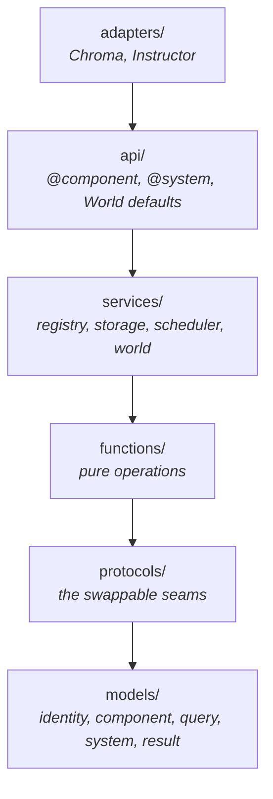

# Altitudes

The same runtime, described four times at decreasing altitude. Altitude 0 is the mental
model. Altitude 3 is the code. Each level refines the one above rather than replacing it.

---

## Altitude 0 — The mental model

AgentECS is a transactional loop over a component database.

A **tick** is the transaction. Inside a tick, every system reads a consistent snapshot,
proposes changes into a private log, and the runtime commits those logs in a defined
order. Nothing a system does is visible to another system within the same group.

That is the entire design. Everything else — access declarations, provisional entity
IDs, `Combinable`, the copy-on-read discipline — exists to make that transaction safe
while systems run concurrently.

Why this shape for agents: an agent is not an object with methods, it is a row of
components. "Spawn a sub-agent" is an insert. "Two agents pool their context" is a merge
of `Combinable` components. "All agents holding a budget re-plan" is a query. The
orchestration graph that other frameworks make explicit is, here, the set of component
types each system declared.

---

## Altitude 1 — The packages

Six runtime layers, named by *kind* rather than by domain, and strictly ordered by
dependency direction. Outer imports inner; never the reverse.



The split that matters is **`models/`, `protocols/` and `functions/` are stateless;
`services/` is not**. A model is data: an `EntityId` is three integers, a
`SystemDescriptor` is a frozen record. A function is a pure operation over models:
`combine_protocol_or_fallback` is a pure binary operation. Neither mutates runtime state,
which is why the same code can be reasoned about — and eventually run — on any node.

Everything that keeps state is a service, and each service owns exactly one concern.
`.importlinter` enforces that none of them imports another, with no exceptions: the
scheduler does not know `World` exists, and `World` does not know which scheduler it has.
Where a domain genuinely spans several files — `services/world/`, `services/storage/` —
it is a subpackage, so "one service, one concern" survives the file count.

The mutual recursion between the world and the scheduler is real at runtime (the
scheduler calls `World.execute_system_async()`, and `World.tick_async()` calls the
scheduler) but it is not an import cycle: the scheduler depends on the `SystemExecutor`
protocol, and `World` depends on `ExecutionStrategy`. Both point at `protocols/`.

### The protocol seams

Three `Protocol` definitions are the framework's real extension points. All are
structural — implement the methods, pass the object in, no inheritance.

| Seam | Protocol | Injected where | Shipped implementation |
| --- | --- | --- | --- |
| Persistence | `Storage` (`protocols/storage.py:23`) | `World(storage=...)` | `LocalStorage` |
| Execution | `ExecutionStrategy` (`protocols/execution.py:28`) | `World(execution=...)` | `SimpleScheduler` |
| Executor | `SystemExecutor` (`protocols/execution.py:15`) | the scheduler's `world` argument | `World` |

`SystemExecutor` is the narrow slice of `World` a strategy is allowed to touch — two
methods, `execute_system_async` and `apply_result_async`. It exists so the scheduler can
be typed against what it actually uses rather than against the whole coordinator.

A fourth, narrower seam sits inside the scheduler: `ExecutionGroupBuilder`
(`protocols/execution.py:58`) is a callable deciding how registered systems are
partitioned into groups. Swapping it is how dependency-ordered or frequency-based
scheduling would arrive without touching the scheduler itself.

### Where the World's defaults live

`agentecs.services.world.World` requires both seams — there is no default storage and no
default strategy. `agentecs.api.world.World`, the class the facade exports, is a
subclass whose `__init__` fills in `LocalStorage()` and `SimpleScheduler()`. Keeping the
composition root in `api/` is what lets the world service depend on `protocols/` alone.

---

## Altitude 2 — The modules

### `models/identity.py` — what an entity is

An `EntityId` (`models/identity.py:13`) is a frozen, slotted triple of
`(shard, index, generation)`. It carries no data and no back-reference to the world.

`generation` makes recycling safe: when an index is freed, `EntityAllocator.deallocate()`
bumps the generation, so a stale handle to the old generation fails
`EntityAllocator.is_alive()` instead of silently addressing whoever took the slot.
`shard` is reserved for distribution — every value is `0` today, and `is_local()` is the
only consumer.

`SystemEntity` reserves the first 1000 indices for singletons. Only `WORLD` and `CLOCK`
are actually created (`services/world/world.py:65`); `SCHEDULER` is declared but never
instantiated.

### `models/component.py` and `functions/component.py` — what data is

A component is any dataclass or Pydantic model that has passed through `@component`
(`api/decorators.py:47`). The decorator validates the shape, computes a
deterministic type ID as the first 64 bits of `sha256(module.qualname)`, and stores the
metadata on the class as `__component_meta__`.

The ID is deterministic on purpose: two processes running the same code agree on
component identity without negotiating a registry. Collisions raise at registration time
(`services/registry.py:46`) rather than corrupting lookups later.

Two optional protocols change how the framework handles a component:

- `Combinable.__combine__(self, other)` — fold two values of the same type into one.
  Used when repeated writes hit the same `(entity, type)` key, and when entities merge.
  Without it, the fallback is last-writer-wins.
- `Splittable.__split__(self)` — produce two values from one. Without it, the fallback
  is two deep copies.

Both are applied through the free functions in `functions/component.py`, never by
calling the dunder directly, so the fallback path is always in play.

`Shared[T]` (`models/component.py:68`) is a wrapper that changes *storage
semantics* rather than data: a component wrapped in `Shared` is stored once in
`LocalStorage._shared_components` and referenced by many entities, with refcount-style
garbage collection when the last reference goes. `get_type()` and `get_component()` are
the unwrapping helpers used throughout the runtime so that wrapped and plain components
are interchangeable at call sites.

### `models/query.py` and `functions/query.py` — what a system may touch

`Query` (`models/query.py:24`) is an immutable builder: `Query(A, B).having(C)`
and `.excluding(D)` each return a new instance.

Access declarations normalize into one of four `AccessPattern` variants:

| Written as | Becomes | Meaning |
| --- | --- | --- |
| omitted (both reads and writes) | `AllAccess` | unrestricted |
| `()` | `NoAccess` | nothing |
| `(A, B)` | `TypeAccess` | all entities with those types |
| `Query(A).excluding(B)` | `QueryAccess` | archetype-filtered |

`normalize_reads_and_writes()` (`functions/query.py:76`) encodes one deliberate
asymmetry: declaring *either* reads or writes makes the other default to `NoAccess`.
Only declaring neither yields full access. This prevents `reads=(A,)` from accidentally
granting writes.

### `models/system.py` and `api/decorators.py` — what behaviour is

`@system(...)` does not wrap the function. It returns a `SystemDescriptor`
(`models/system.py:29`) — a frozen record holding the callable, its normalized
access patterns, its mode, and whether it is a coroutine. Registration hands that record
to the scheduler.

Three decorator forms produce three shapes:

- `@system(reads=..., writes=...)` — declared access, runs in the parallel group.
- `@system.dev()` — `AllAccess` both ways and `runs_alone=True`, so the group builder
  gives it a group of its own.
- `@system.readonly(reads=...)` — writes forced to `NoAccess`, and `_check_writable`
  rejects every mutation attempt.

`SystemMode` has three values, but only `READONLY` currently changes runtime behaviour.
See [Invariants and Known Gaps](invariants.md#declared-but-not-wired).

### `services/storage/` — where data rests

`Storage` is a protocol; `LocalStorage` (`services/storage/local.py:27`) is the single
implementation. It is a nested dict, `_components[entity][type] = instance`, plus two
side tables for shared components. Queries are an O(n) scan over all entities
(`services/storage/local.py:262`) — the archetypal layout that would make this O(matched) is
roadmap, not present.

The important behavioural detail is `copy=True` by default on every read path. Storage
hands out deep copies unless an internal caller explicitly opts out. `snapshot()` and
`restore()` are `pickle`, marked in-source as prototype-only.

### `services/world/` — the coordinator

Three files, each with a distinct job:

| File | Job |
| --- | --- |
| `world.py` | Owns storage and the strategy. Entity lifecycle outside systems. Applies results. |
| `access.py` | `ScopedAccess` — the object systems actually receive. Enforcement and buffer overlay. |
| `sync_runner.py` | A background event loop so synchronous systems can call async internals. |

The result machinery that used to sit alongside them is now split by kind:
`SystemResult` and `MutationOp` are in `models/result.py`, and return-value
normalization plus write-contract validation are in `functions/result.py`.

`World` exposes two parallel APIs that are easy to confuse. The public methods
(`spawn`, `destroy`, `get_copy`, `set`, `query_copies`, `merge_entities`,
`split_entity`) act on storage **immediately** and are for use *outside* systems — setup,
tests, REPL. The underscore-prefixed methods (`_get_component`, `_query_components`,
`_all_entities`, …) are the thin pass-throughs `ScopedAccess` uses.

`SyncRunner` (`services/world/sync_runner.py:11`) deserves a note. All internal read paths are
async so that a future remote storage backend can be genuinely asynchronous. Synchronous
systems still need to call them, so `SyncRunner` is a process-wide singleton holding a
daemon thread running an event loop, and `run()` marshals a coroutine onto it via
`run_coroutine_threadsafe`. That is why `ScopedAccess.get()` is a sync method whose body
is one line delegating to `get_async()`.

### `services/scheduler.py` — the loop

`SimpleScheduler` (`services/scheduler.py:43`) holds registered descriptors, caches an
`ExecutionPlan`, and invalidates that cache whenever a system is registered.

A plan is a `list[ExecutionGroup]`. Groups run **sequentially**; systems inside a group
run **concurrently** and their results are applied together at the group boundary. The
only shipped builder, `build_single_group_plan` (`functions/scheduling.py:9`), emits one
solo group per dev-mode system followed by a single group containing everything else.

Concurrency is `asyncio.gather`, optionally behind a `Semaphore` when
`SchedulerConfig.max_concurrent` is set. `SequentialScheduler()` is not a class — it is a
factory returning `SimpleScheduler` with `max_concurrent=1`.

Retry is opt-in, per-system, and delegates to `tenacity` when available. With
`on_exhausted="skip"` a permanently failing system contributes an empty `SystemResult`
and the tick proceeds; with `"fail"` the tick raises.

---

## Altitude 3 — The functions that carry the weight

Five functions contain most of the semantics. Everything else is plumbing around them.

### `World.execute_system_async` — `services/world/world.py:291`

The unit of isolation. Creates a fresh `SystemResult`, wraps it in a `ScopedAccess`
bound to this descriptor, runs the system (awaiting it if `descriptor.is_async`), folds
any returned shorthand into the same buffer, and validates the whole buffer against the
declared write contract before handing it back.

```python
result_buffer = SystemResult()
access = ScopedAccess(world=self, descriptor=descriptor, buffer=result_buffer)

returned = await descriptor.run(access) if descriptor.is_async else descriptor.run(access)

if returned is not None:
    result_buffer.merge(normalize_result(returned))

validate_result_access(result_buffer, descriptor.writes, descriptor.name)
return result_buffer
```

Note the ordering: imperative mutations were already checked as they happened, inside
`ScopedAccess`. Returned mutations are only checked here, and only for *write contract*,
not for entity existence. That asymmetry is the open gap tracked as the PR #89 follow-up.

### `ScopedAccess._query_raw_async` — `services/world/access.py:335`

The buffer overlay, and the most intricate function in the codebase. It answers "what
would this query see, given storage plus my own uncommitted writes?" in two passes:

1. **Stream storage.** For each matching entity, skip it if this system destroyed it or
   removed one of the requested types; otherwise substitute any buffered update for the
   stored value and yield a deep copy.
2. **Sweep the buffer.** Entities touched only in the buffer — updated into matching an
   archetype, or freshly inserted — have not been yielded yet. Reconstruct each
   candidate from buffer first, storage second, and yield if it has every requested type.

`refresh_buffer_views()` exists because the buffer's `updates`/`inserts`/`removes`
properties are *materialized on every access* — they walk the op log and rebuild dicts.
Caching them against `_buffer._next_op_seq` as a version counter avoids rebuilding once
per yielded entity, while still picking up writes a system makes mid-iteration.

### `SystemResult.record_*` — `models/result.py:59-137`

Five near-identical recorders, one per `OpKind`. Each appends a frozen `MutationOp`
carrying a monotonically increasing `op_seq`, and pushes that sequence number onto a
per-kind index list.

The dual representation is the point. `_ops` is the ordered truth used at apply time.
The `updates` / `inserts` / `removes` / `spawns` / `destroys` properties are
convenience projections rebuilt on demand — cheap to read, never authoritative. When
apply order and a projection disagree, apply order wins.

### `World.apply_result_async` — `services/world/world.py:325`

The commit. Walks `result.ops` **in sequence order** and folds writes as it goes:

```python
key = (op.entity, op.component_type)
if key in written and isinstance(op.component, Combinable):
    written[key] = combine_protocol_or_fallback(written[key], op.component)
else:
    written[key] = op.component
self._storage.set_component(op.entity, component=written[key])
```

`written` is a fold accumulator, not a cache — `set_component` is called on every op, so
storage sees each intermediate value. The `Combinable` branch is what makes two parallel
systems each adding a message to a shared context end up with both messages instead of
one clobbering the other.

`DESTROY` drops every pending write for that entity from `written`; `REMOVE` drops the
single key. `SPAWN` allocates a real `EntityId` through `World.spawn()` and returns it in
the list of new entities.

### `ScopedAccess._check_writable` — `services/world/access.py:213`

The enforcement point, and deliberately three-tiered so error messages are actionable:

1. Dev-mode systems return immediately — no checks at all.
2. `READONLY` mode rejects everything with a mode-specific message.
3. Otherwise: allowed if writable; if only *readable*, the error says "declared as
   read-only"; if neither, "not in writable types".

Enforcement granularity is **type-level**. `QueryAccess` is flattened via
`QueryAccess.types()` before checking, so `excluding()` clauses are documentation and
scheduler input, not a runtime guard on which entities you may write.
