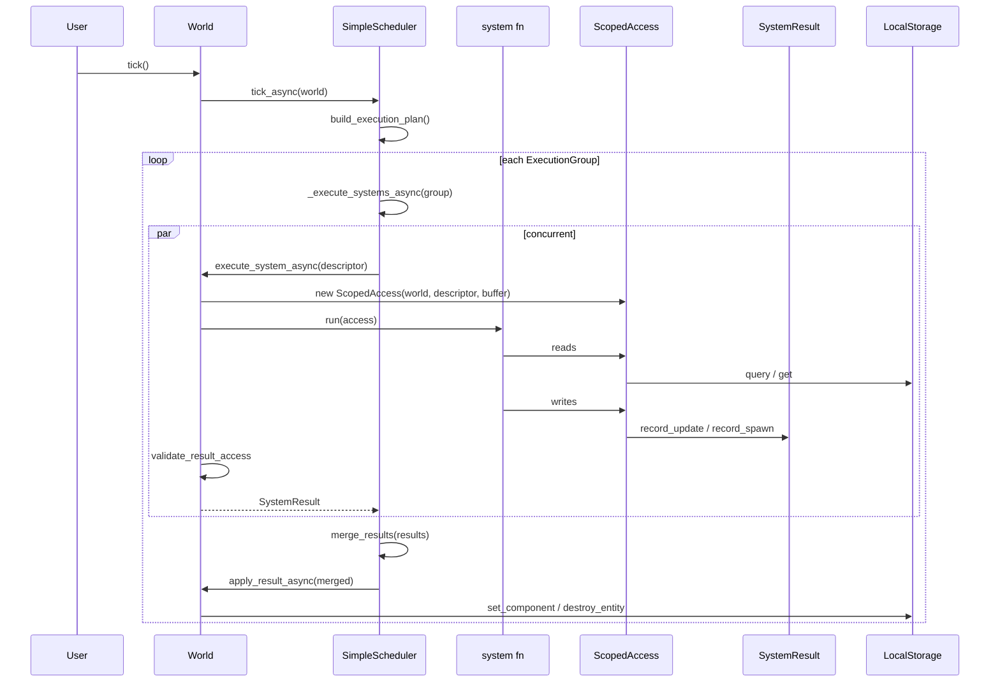

# Call Stacks

Seven end-to-end traces through the runtime. Each one starts at a line of user code and
follows control flow down to storage and back, naming every frame with `file:line`.

Read these when you need to know *where* to put a change, or *why* something you wrote
did not take effect.

---

## 1. A full tick

The spine of the framework. Everything else hangs off this.

```python
world.tick()
```



Frame by frame:

| # | Frame | What happens |
| --- | --- | --- |
| 1 | `World.tick` — `services/world/world.py:400` | `asyncio.run(self.tick_async())`. A convenience wrapper; it will fail if a loop is already running. |
| 2 | `World.tick_async` — `services/world/world.py:392` | Delegates to the injected strategy. `World` has no loop logic of its own. |
| 3 | `SimpleScheduler.tick_async` — `services/scheduler.py:78` | Builds the plan if the cache is cold, then iterates groups **sequentially**. |
| 4 | `build_single_group_plan` — `functions/scheduling.py:9` | Partitions: one solo group per `runs_alone` system, then one group for the rest. |
| 5 | `SimpleScheduler._execute_group_async` — `services/scheduler.py:86` | Execute → merge → apply, for this group only. |
| 6 | `SimpleScheduler._execute_systems_async` — `services/scheduler.py:100` | `asyncio.gather`, wrapped in a `Semaphore` if `max_concurrent` is set. |
| 7 | `SimpleScheduler._execute_with_retry` — `services/scheduler.py:121` | Pass-through unless `RetryPolicy.max_attempts > 1`. See trace 7. |
| 8 | `World.execute_system_async` — `services/world/world.py:291` | Fresh buffer, fresh `ScopedAccess`, run, fold return value, validate. |
| 9 | `merge_results` — `functions/result.py:14` | Concatenates each system's ops into one `SystemResult`, **in registration order**. |
| 10 | `World.apply_result_async` — `services/world/world.py:325` | Replays ops in `op_seq` order against storage. |

Three things to hold onto:

- **Groups are the commit boundary, not ticks.** With the default builder there is at
  most one non-dev group, so the two coincide — but a dev-mode system's writes land
  before the main group starts.
- **Merge order is registration order.** Two systems writing the same
  `(entity, type)` without `Combinable` resolve to whichever registered later.
- **`tick()` is `asyncio.run`.** Inside an existing event loop, call `tick_async()`.

---

## 2. Reading inside a system

```python
for entity, pos, vel in world(Position, Velocity):
    ...
```

```text
ScopedAccess.__call__              services/world/access.py:267   ← _check_readable, returns lazily
  QueryResult.__iter__             services/world/access.py:75    ← flattens (e, (c1, c2)) → (e, c1, c2)
    ScopedAccess._query_raw        services/world/access.py:320
      SyncRunner.iterate           services/world/sync_runner.py:49
        SyncRunner.run             services/world/sync_runner.py:42   ← run_coroutine_threadsafe
          ScopedAccess._query_raw_async   services/world/access.py:335
            World._query_components_async services/world/world.py:272
              LocalStorage.query_async    services/storage/local.py:361
                LocalStorage.query        services/storage/local.py:262   ← O(n) scan, copy=True
```

`__call__` checks readability **once**, at query construction, then returns a
`QueryResult` that has done no work yet. The scan happens on iteration.

Every value crosses two copy boundaries: `LocalStorage.query` deep-copies out of
storage, and `_query_raw_async` deep-copies again while overlaying the buffer. That is
deliberate — no reference into world state escapes to a system — and it is the single
largest cost in a tick.

The overlay is what makes the loop see the system's own uncommitted writes. Pass one
substitutes buffered updates for stored values and skips buffered destroys and removes;
pass two picks up entities that only exist, or only match, because of this system's
buffer. `refresh_buffer_views()` re-materializes the projections only when
`_buffer._next_op_seq` has moved, so writing inside the loop is visible to later
iterations without rebuilding dicts on every yield.

!!! warning "Same-tick read divergence"
    The overlay returns the *latest buffered value* for a key. Apply time instead folds
    repeated writes through `__combine__`. For a `Combinable` component written twice in
    one system, what you read back mid-tick is not what will be committed. Tracked as
    `REQ-062`.

---

## 3. Writing inside a system

```python
world[entity, Position] = Position(1.0, 2.0)
```

```text
ScopedAccess.__setitem__           services/world/access.py:246
  ScopedAccess.update              services/world/access.py:489
    ScopedAccess._check_writable   services/world/access.py:213   ← AccessViolationError
    ScopedAccess._check_entity_exists services/world/access.py:203 ← KeyError
    SystemResult.record_update     models/result.py:59    ← MutationOp(op_seq=n, UPDATE)
```

No storage call. The write is an append to the op log, and that is the whole operation.

The component type is inferred from the *value*, not the subscript — `world[e, Position] = vel`
records a `Velocity` update and the `Position` in the key is ignored. The subscript form
exists for readability.

`_check_entity_exists` is buffer-aware: an entity spawned earlier in this same system
(and therefore holding a provisional negative ID) counts as existing, while one this
system already destroyed does not.

**The returned-mutation path skips both checks.** A system that returns
`{entity: Position(...)}` instead of assigning goes through `normalize_result`
(`functions/result.py:22`) → `SystemResult.merge` (`models/result.py:206`), and only
`validate_result_access` (`functions/result.py:75`) runs afterwards. That validates the
write *contract* but not entity existence, so a returned write to a dead entity still
reaches `apply_result_async`. This is the known asymmetry from the REQ-040 review.

---

## 4. Spawning inside a system

```python
child = world.spawn(Agent("worker"), Task("summarize"))
```

```text
ScopedAccess.spawn                 services/world/access.py:512
  ScopedAccess._check_writable     services/world/access.py:213   ← once per component
  (duplicate-type check → warnings.warn)
  EntityId(shard=0, index=-(spawn_count + 1), generation=0)   ← provisional
  SystemResult.record_spawn        models/result.py:112
```

The returned ID is **provisional and negative**. Real allocation happens at apply:

```text
World.apply_result_async           services/world/world.py:325
  op.kind == SPAWN
    World.spawn                    services/world/world.py:76
      LocalStorage.create_entity   services/storage/local.py:79
        EntityAllocator.allocate   services/storage/allocator.py:32   ← free list, then _next_index
      LocalStorage.set_component   services/storage/local.py:148      ← per component
```

Negative indices cannot collide with real ones because `EntityAllocator` starts at
`SystemEntity._RESERVED_COUNT` (1000) and only ever counts up.

!!! danger "Provisional IDs are not remapped"
    `apply_result_async` records the real `EntityId` and returns it, but it does **not**
    rewrite later ops that reference the provisional ID. So this does not work:

    ```python
    child = world.spawn(Agent("worker"))
    world[child, Task] = Task("summarize")   # targets the provisional ID
    ```

    The update op carries the negative ID and will not find the newly created entity.
    Pass everything the entity needs into the `spawn()` call itself. Tracked as `REQ-039`.

---

## 5. Spawning outside a system

```python
entity = world.spawn(Position(0, 0), Velocity(1, 0))
```

```text
World.spawn                        services/world/world.py:76
  LocalStorage.create_entity       services/storage/local.py:79
    EntityAllocator.allocate       services/storage/allocator.py:32
  LocalStorage.set_component       services/storage/local.py:148   ← per component
```

Immediate and unbuffered. `World.spawn`, `destroy`, `set`, `get_copy`, and
`query_copies` all commit straight to storage — they are the setup/test/REPL API and
carry no access enforcement.

`set_component` handles the `Shared` wrapper: a wrapped component is stored once in
`_shared_components` keyed by `ref_id`, with `(entity, type) → instance_id` recorded in
`_shared_refs`. Overwriting a shared component with a plain one deletes the reference and
garbage-collects the instance if nothing else points at it (`services/storage/local.py:64`).

Same-type duplicates in one `spawn()` call warn and keep the last.

---

## 6. Merging two entities

Merging exists in two places with the same semantics and different timing.

**Inside a system** — `ScopedAccess.merge_entities` (`services/world/access.py:536`), buffered:

```text
_check_entity_exists × 2           services/world/access.py:203
_buffered_component_types × 2      services/world/access.py:290   ← storage types ± buffer
for each type present on both:
  ScopedAccess.get × 2             services/world/access.py:282
  combine_protocol_or_fallback     functions/component.py:17
ScopedAccess.spawn(*merged)        services/world/access.py:512   ← provisional ID
ScopedAccess.destroy × 2           services/world/access.py:531
```

**Outside a system** — `World.merge_entities` (`services/world/world.py:133`), immediate:

```text
entity_exists × 2                  services/storage/local.py:107   ← ValueError if missing
get_component_types × 2            services/storage/local.py:244
combine_protocol_or_fallback       functions/component.py:17
World.spawn(*merged)               services/world/world.py:76      ← real ID, returned
World.destroy × 2                  services/world/world.py:92
```

Both produce a **new** entity and destroy both inputs. Neither mutates in place.

The fold is per component type. Present on both → `__combine__`, or entity 2 wins if the
type is not `Combinable`. Present on one → carried over unchanged.

`split_entity` is the mirror image, through `split_protocol_or_fallback`
(`functions/component.py:36`), with two deep copies as the fallback.

The only difference between the two versions is *when* the effect lands, and that the
scoped version sees the current system's buffered inserts and removes via
`_buffered_component_types`.

---

## 7. An access violation, and a retry

### Violation raised during execution

```python
@system(reads=(Position,), writes=(Position,))
def bad(world):
    world[e, Health] = Health(100)
```

```text
ScopedAccess.update                services/world/access.py:489
  ScopedAccess._check_writable     services/world/access.py:213
    descriptor.can_write_type      models/system.py:51
      SystemDescriptor._pattern_allows models/system.py:55
    → AccessViolationError("bad: Health: not in writable types")
```

The exception propagates out of the system, out of `execute_system_async`, through
`asyncio.gather`, and fails the tick. A declared-but-read-only type produces the more
specific "declared as read-only" message instead.

### Violation raised after execution

```python
@system(reads=(Position,), writes=(Position,))
def bad(world):
    return {e: Health(100)}
```

```text
World.execute_system_async         services/world/world.py:291
  normalize_result                 functions/result.py:22
  SystemResult.merge               models/result.py:206
  validate_result_access           functions/result.py:75
    → AccessViolationError("bad wrote Health: not in writable types")
```

Same outcome, different frame — and this path checks only `updates` and `inserts`.
Removes, spawns, and destroys in a returned result are not contract-checked, and
`AllAccess` returns early from the whole function.

### Retry

```python
SimpleScheduler(config=SchedulerConfig(
    retry_policy=RetryPolicy(max_attempts=3, backoff="exponential", on_exhausted="skip")
))
```

```text
SimpleScheduler._execute_with_retry  services/scheduler.py:121
  SimpleScheduler._build_retryer     services/scheduler.py:152   ← tenacity.AsyncRetrying
  async for attempt in retryer:
      World.execute_system_async     services/world/world.py:291            ← fresh buffer each attempt
  on RetryError:
      on_exhausted == "skip"  → SystemResult()   ← empty, tick continues
      on_exhausted == "fail"  → RuntimeError from last exception
```

Each attempt gets a brand-new `SystemResult` and `ScopedAccess`, so a partially-written
buffer from a failed attempt is discarded rather than replayed. Retry is for systems that
call flaky external services — an LLM adapter, a vector store. Requires the `retry`
extra; without `tenacity` installed, configuring `max_attempts > 1` raises `ImportError`
at tick time.
