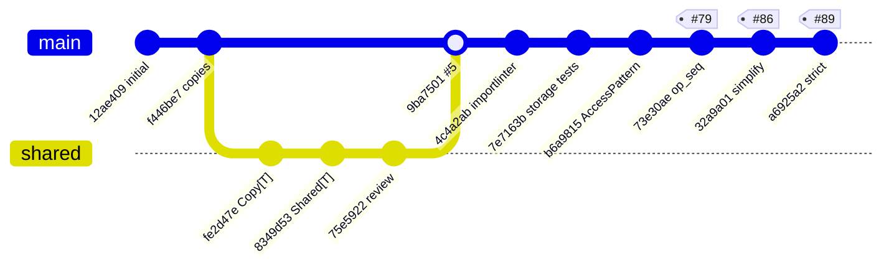

# Illustrated Commit History

Forty-three commits between February and September 2026 got the runtime to its current
shape. This page groups them into five eras, each driven by a distinct architectural
pressure, and says what each era means for reading the code today.

If you have been away, the short version is at the [bottom](#if-you-last-read-this-at).



---

## Era 1 — Foundation

**2026-02-01 → 2026-02-03 · 12 commits · `12ae409` … `6770e41`**

The initial commit landed the whole skeleton at once: 120 files, 22k lines, every
package that exists today except the pieces that were later deleted. `core/`,
`storage/`, `world/`, `scheduling/`, `adapters/`, `tracing/`, and a full test tree
arrived together.

The layer split — stateless `core/` versus stateful services — was present from line
one. It was never refactored in; it was the starting assumption.

The era's one consequential change was `f446be7`, **"Scoped Access returns copies"**.
Before it, reads handed out references into storage, so mutating a component you read
silently mutated world state and bypassed the buffer entirely. After it, every read
deep-copies and the caller must write back explicitly.

!!! quote "Why it matters now"
    This is the origin of the copy-on-read discipline, the `get_copy` / `query_copies`
    naming, and the "reads return copies, write it back" rule repeated throughout the
    docs. It cost performance and bought the ability to reason about a tick.

---

## Era 2 — Copy and sharing semantics

**2026-02-05 → 2026-02-20 · 14 commits · `fe2d47e` … `9ba7501` (PR #5, REQ-016)**

The longest and messiest era, and the one that produced the most subtle code.

`fe2d47e` introduced the `Copy[T]` type alias — a no-op at runtime, `type Copy[T] = T`,
existing purely to mark in signatures which values are detached from world state. It
also pushed the copy decision down into storage as a `copy: bool` parameter, so internal
callers could opt out of copying while the public API could not.

`8349d53` added the opposite semantics: `Shared[T]`, a wrapper that makes one component
instance live at many entities. `LocalStorage` grew two side tables (`_shared_refs`,
`_shared_components`) and refcount-style garbage collection, which is most of the
complexity in that file today.

The seven commits that follow are a bug tail, and reading their subjects is the fastest
way to understand where the sharp edges are:

| Commit | Subject |
| --- | --- |
| `f84d92e` | unwrap shared components on read, fix query storage mutation |
| `02d3472` | leak if overwriting wrapped with unwrapped |
| `25ee311` | bugs when accessing shared components |
| `9603d6d` | copy duplication |
| `1460462` | add shared remove function to protocol |
| `4e1c832` | setattr did not work |
| `a641092` | accidental returns of `Shared` wrapper due to local cache |
| `41fca17` | regular overwritten by wrapped component cleanup |

!!! quote "Why it matters now"
    Every one of those is a wrapper-leak or aliasing bug. They are why `get_type()` and
    `get_component()` (`core/component/wrapper.py:47`) are called at nearly every call
    site that handles a component: wrapped and plain instances must be
    indistinguishable to the rest of the runtime, and each of these commits is a place
    where they briefly were not.

---

## Era 3 — Enforcing the boundaries

**2026-02-20 → 2026-02-22 · 8 commits · `4c4a2ab` … `7e7163b`**

Having discovered how easy the layers were to violate, this era made violations
mechanical failures.

`4c4a2ab` added `.importlinter` with three contracts — the layer ordering, a ban on
internal modules importing the root `agentecs` facade, and a ban on `storage/` importing
the `core` package facade rather than leaf modules — plus `docs/system/development-architecture.md`
to document them, and wired `task lint:imports` into CI.

`5f3f382` removed a decorator-based registration path that duplicated the existing one,
with `e990023` stripping it from the docs. The codebase standard "never add a pattern
that replicates existing behaviour" traces to this deletion.

`49967b2` and `7e7163b` added user-journey tests for the `Shared` wrapper and for storage
component handling — the two areas Era 2 proved fragile.

!!! quote "Why it matters now"
    Import direction is not a convention here, it is a check. If a change fails
    `task lint:imports`, the fix is almost always to move the code rather than to relax
    the contract.

---

## Era 4 — Access patterns and ordered mutations

**2026-02-22 → 2026-02-25 · 3 commits · `b6a9815`, `2276841`, `73e30ae`**

Small in commit count, largest in design consequence.

`b6a9815` (**"Use AccessPattern throughout consistently"**) replaced ad-hoc tuple
handling with the four-variant `AccessPattern` union — `AllAccess`, `NoAccess`,
`TypeAccess`, `QueryAccess` — and made normalization a single function pair in
`core/query/operations.py`. It also introduced the asymmetry where declaring only reads
forces writes to `NoAccess`, closing an accidental-write-permission hole.

`2276841` moved examples out to
[agentecs-examples](https://github.com/extensivelabs/agentecs-examples), which is why the
repository has no `examples/` directory and the Taskfile carries a note where one used
to be.

`73e30ae` (**"Implement op sequence in result"**, PR #79) is the pivot. `SystemResult`
stopped being a bag of dicts and became an **ordered log** of frozen `MutationOp`s, each
carrying a monotonic `op_seq`, with the old dict shapes demoted to convenience
projections rebuilt on demand.

```text
before                              after
──────                              ─────
SystemResult                        SystemResult
  updates: {e: {T: c}}                _ops: [MutationOp(op_seq=0, UPDATE, ...),
  inserts: {e: [c]}                          MutationOp(op_seq=1, SPAWN, ...), ...]
  removes: {e: [T]}                   updates  → projection over _ops
  spawns:  [e]                        inserts  → projection over _ops
  destroys:[e]                        removes  → projection over _ops
```

!!! quote "Why it matters now"
    "`SystemResult` operation order is authoritative" is the single most load-bearing
    sentence about the runtime, and it starts here. Deterministic apply, correct
    interleaving of spawn-then-write, and the whole `Combinable` folding story depend on
    it. It also created the performance footgun that projections are materialized on
    every property access — the reason `_query_raw_async` version-caches them.

---

## Era 5 — Simplification and strictness

**2026-03-15 → 2026-09-10 · 2 commits · `32a9a01` (PR #86), `a6925a2` (PR #89)**

`32a9a01` (**"Simplify the scheduler and merging"**) deleted more than it added: 732
insertions against 1374 deletions across 27 files. `scheduling/merge_strategies.py` —
139 lines of pluggable merge policy — was removed entirely, along with a broader set of
component operation protocols.

What survived is deliberately small: `Combinable.__combine__`, `Splittable.__split__`,
and two fallbacks (last-writer-wins, deep copy). Merge semantics moved out of the
scheduler and into `World.apply_result_async`, leaving the scheduler responsible for
orchestration only — grouping, concurrency, retry.

`a6925a2` (**"Strict storage write policy"**, PR #89, REQ-040) added
`ScopedAccess._check_entity_exists` (`world/access.py:231`) so that imperative writes to
unknown or destroyed entities fail immediately with `KeyError` instead of implicitly
creating a component bucket. The check is buffer-aware: an entity spawned earlier in the
same system counts as existing. The same PR gave `EntityId` an explicit `__eq__`, and
added `_buffered_component_types` so `merge_entities` and `split_entity` see buffered
inserts and removes.

!!! quote "Why it matters now"
    Two lessons are encoded here. First, the scheduler is *orchestration only* — if you
    find yourself adding merge semantics to `scheduling/`, it belongs in
    `world/result.py` or `apply_result_async`. Second, strictness landed at the access
    layer, not the storage layer: `LocalStorage.set_component` still creates buckets
    freely, and returned mutations still bypass the existence check. See
    [Invariants and Known Gaps](invariants.md#returned-mutations-skip-existence-checks).

---

## What the deletions tell you

Three subsystems were built and then removed. The pattern is consistent enough to be a
design rule.

| Removed | In | Replaced by |
| --- | --- | --- |
| Decorator registration path | `5f3f382` | The single existing registration path |
| `scheduling/merge_strategies.py` | `32a9a01` | `Combinable` + fallback, applied at apply time |
| Extended component operation protocols | `32a9a01` | `Combinable` and `Splittable` only |
| `examples/` | `2276841` | A separate repository |

Each removal traded configurability for one obvious path. When adding to this codebase,
the burden of proof is on the second way of doing something.

---

## If you last read this at…

| Your last commit | What changed since |
| --- | --- |
| `12ae409` (initial) | Everything on this page. Start at [Altitudes](altitudes.md). |
| Era 2 (`9ba7501`, PR #5) | Import contracts are enforced. `SystemResult` is an ordered op log, not dicts. Merge strategies are gone. Writes to dead entities raise. |
| Era 3 (`7e7163b`) | `AccessPattern` normalization, `op_seq` ordering, the PR #86 simplification, and strict write policy. |
| `73e30ae` (op_seq) | `merge_strategies.py` deleted; merge semantics moved to `apply_result_async`. Scheduler is orchestration-only. Strict entity-existence checks in `ScopedAccess`. |
| `32a9a01` (PR #86) | Only REQ-040: `_check_entity_exists`, `EntityId.__eq__`, buffer-aware merge/split. |

## Open threads

Three requirements are in flight and shape what you will find half-done:

- **REQ-039** — provisional-to-real spawn identity. Ops referencing a provisional ID are
  not remapped at apply time.
- **REQ-062** — same-tick buffered read consistency. Mid-tick reads of a `Combinable`
  diverge from the committed fold.
- **PR #89 follow-up** — returned mutations bypass entity-existence checks after
  normalization.

Specs live under `.agents/specs/`; requirements are tracked in GitHub Project
`extensivelabs/agentecs` #1.
