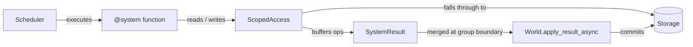

# Architecture Deep Dive

This section is the internals reference for AgentECS. It is written for someone who
needs to hold the whole runtime in their head again — a returning maintainer, a new
contributor, or anyone about to change behaviour rather than use it.

It differs from the [System](../system/index.md) section in intent. System documentation
describes the model you program against. This section describes the machine that
implements it, at the level of files, functions, and line numbers.

## How to read this section

Read it in order the first time. Each page assumes the one before it.

- :material-layers-triple: **[Altitudes](altitudes.md)**

    The same system described four times, from the one-paragraph mental model down to
    the individual functions that carry each responsibility.

- :material-stairs: **[Call Stacks](call-stacks.md)**

    Seven end-to-end traces — a tick, a read, a write, a spawn, a merge, an access
    violation, a retry — each one following control flow across every layer.

- :material-shield-check: **[Invariants and Known Gaps](invariants.md)**

    What the runtime actually guarantees, and the list of things that are declared in
    the API but not yet wired to behaviour. Read this before trusting a docstring.

- :material-source-commit: **[Illustrated Commit History](commit-history.md)**

    How the design arrived here, in five eras, with the architectural pressure behind
    each one.

## Thirty-second refresher

A `World` owns a `Storage` backend and an `ExecutionStrategy` (the scheduler).

Calling `world.tick()` asks the scheduler for an execution plan, runs each group of
systems concurrently against a frozen view of storage, concatenates what they produced,
and writes the whole batch back at the group boundary.

Systems never touch storage. They receive a `ScopedAccess` — a view narrowed to the
component types they declared — and every mutation they make is appended to a private
`SystemResult` buffer as an ordered `MutationOp`. Reads consult that buffer first, so a
system sees its own writes but not its peers'.

Three consequences follow from that picture, and most of the subtlety in the codebase
comes from them:

1. **Reads return copies.** `ScopedAccess.get()` deep-copies everything on the way out,
   so mutating what you read changes nothing. You must write the value back.
2. **Writes are ordered, not merged.** Each op carries an `op_seq`. Apply order is
   authoritative; `Combinable.__combine__` only folds repeated writes to the same
   `(entity, type)` key.
3. **Parallel systems do not see each other.** They compute from the same starting
   state. Combining their independent full values at apply time is why `__combine__`
   implementations need to be additive rather than assume they ran in sequence.

## Where the code lives

| Package | Role | Stateful? |
| --- | --- | --- |
| `models/` | Identity, components, queries, system descriptors, results, settings | No |
| `protocols/` | `Storage`, `ExecutionStrategy`, `SystemExecutor`, `HistoryStore`, adapter interfaces | No |
| `functions/` | Pure operations: normalization, combining, merging, plan building | No |
| `services/` | `registry`, `scheduler`, `storage/`, `world/` — one concern each | Yes |
| `api/` | `@component`, `@system`, and the `World` that supplies the defaults | Registry only |
| `adapters/` | Optional LLM and vector-store integrations | Boundary |

Tick history (`HistoryStore`, `TickRecord`) is protocol and model only — `World` does
not yet emit records.

Dependency direction is enforced by `.importlinter` and runs as `task lint:imports`.
See [Development & Code Architecture](../system/development-architecture.md) for the
contracts themselves.
