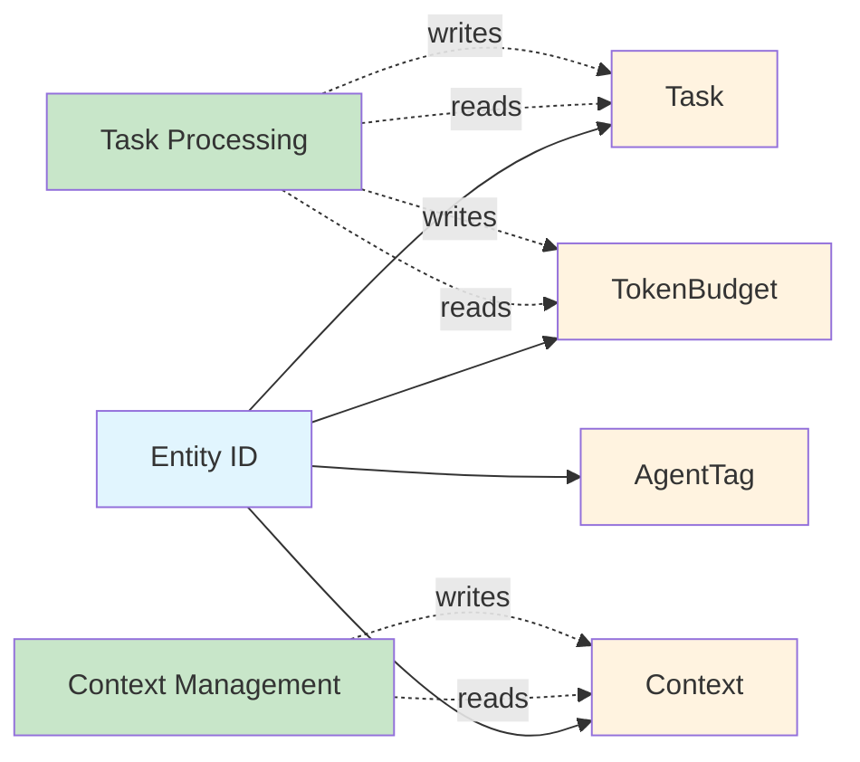
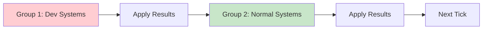

# Core Concepts

AgentECS is built on the **Entity-Component-System (ECS)** architectural pattern. This guide introduces the fundamental concepts and how they enable flexible multi-agent systems.

## The ECS Paradigm

Traditional object-oriented frameworks bundle data and behavior into classes. ECS separates them:

<div class="grid cards" markdown>

- :material-identifier: **Entities**

    Lightweight unique identifiers for agents. Just IDs—no data, no behavior.

- :material-database-outline: **Components**

    Pure data structures. Define *what* an entity is (task state, message history, token budget).

- :material-cog-outline: **Systems**

    Functions that operate on entities with specific components. Define *how* entities behave.

</div>



**Why ECS for AI Agents?**

- **Composition over Inheritance**: Build agents from component combinations, not rigid class hierarchies
- **Emergent Behavior**: Complex workflows emerge from simple system interactions
- **Dynamic Reconfiguration**: Add/remove components at runtime to change agent capabilities
- **Parallel Execution**: Systems run concurrently with snapshot isolation

## Entities: Agent Identities

Entities are unique identifiers with no inherent data or behavior.

**Creating Entities:**

```python
from agentecs import World, component
from dataclasses import dataclass
from enum import Enum

class TaskStatus(Enum):
    PENDING = "pending"
    COMPLETED = "completed"

@component
@dataclass
class Task:
    description: str
    status: TaskStatus

world = World()

# Spawn entity with components
agent = world.spawn(Task("Analyze feedback", TaskStatus.PENDING))
```

**Entity Structure:**

```python
@dataclass(frozen=True)
class EntityId:
    shard: int       # For distributed allocation (0 for local)
    index: int       # Unique index within shard
    generation: int  # Prevents stale references after recycling
```

**Key Properties:**

- **Lightweight**: Just three integers, no memory overhead
- **Generational**: Recycled indices get new generation, preventing confusion
- **Distributed-Ready**: Shard field supports multi-node allocation

## Components: Agent State

Components are plain dataclasses containing only data—no methods (except optional protocols).

**Defining Components:**

```python
from dataclasses import dataclass
from agentecs import component

@component
@dataclass(slots=True)
class Task:
    description: str
    status: str

@component
@dataclass(slots=True)
class Message:
    role: str
    content: str

@component
@dataclass(slots=True)
class Context:
    """Conversation history."""
    messages: list[Message]

@component
@dataclass(slots=True)
class AgentTag:
    """Marker component for AI agents."""
    name: str
```

!!! tip "Use slots=True"
    `@dataclass(slots=True)` reduces memory usage and improves performance. Recommended for all components.

**Pydantic Components:**

For automatic validation, use Pydantic models:

```python
from pydantic import BaseModel, Field
from agentecs import component

@component
class LLMConfig(BaseModel):
    temperature: float = Field(gt=0, le=2.0)
    max_tokens: int = Field(gt=0, le=4096)
    model: str = "claude-sonnet-4-20250514"
```

Requires: `pip install agentecs[config]`

**Component Composition:**

Entities with different component combinations behave differently:

```python
# Simple agent with task
world.spawn(Task("Analyze sentiment", "pending"), AgentTag("Alice"))

# Agent with context tracking
world.spawn(
    Task("Extract entities", "pending"),
    Context(messages=[]),
    AgentTag("Bob")
)

# Complex agent with token budget
world.spawn(
    Task("Summarize text", "pending"),
    Context(messages=[]),
    TokenBudget(available=1000, used=0),
    AgentTag("Charlie")
)
```

### Component Uniqueness

!!! warning "One Component Per Type Per Entity"
    Each entity can have **at most one component of each type**. Attempting to spawn an entity with multiple components of the same type will result in only the last one being kept (with a warning).

This is a fundamental ECS constraint shared by all major frameworks (Unity ECS, Bevy, EnTT). It enables efficient storage patterns like archetypal storage.

**Wrong - only last Task survives:**

```python
# ❌ Silent overwrite - only "Task D" is kept
agent = world.spawn(
    Task("A"),
    Task("B"),
    Task("C"),
    Task("D"),
)
```

**Correct - use a wrapper component:**

```python
# ✅ Use a list wrapper for multiple items
@component
@dataclass
class TaskList:
    tasks: list[Task] = field(default_factory=list)

agent = world.spawn(TaskList(tasks=[
    Task("A"),
    Task("B"),
    Task("C"),
    Task("D"),
]))
```

**Optional Component Protocols:**

Components can implement optional protocols for advanced features:

```python
@component
@dataclass
class TokenBudget:
    available: int
    used: int

    def __merge__(self, other: "TokenBudget") -> "TokenBudget":
        """Combine budgets when merging agents."""
        return TokenBudget(
            available=self.available + other.available,
            used=self.used + other.used
        )

    def __split__(self, ratio: float = 0.5) -> tuple["TokenBudget", "TokenBudget"]:
        """Divide budget when splitting agents."""
        left_available = int(self.available * ratio)
        right_available = self.available - left_available
        return (
            TokenBudget(left_available, 0),
            TokenBudget(right_available, 0)
        )
```

Available protocols: `Mergeable`, `Splittable`, `Reducible`, `Diffable`, `Interpolatable`

See [Components](../system/components.md) for details.

## Systems: Agent Behavior

Systems are functions (sync or async) that query entities and apply transformations.

**Defining Systems:**

```python
from agentecs import system, ScopedAccess

@system(reads=(Task, TokenBudget), writes=(Task, TokenBudget))
def process_tasks(world: ScopedAccess) -> None:
    """Process tasks using available tokens."""
    for entity, task, budget in world(Task, TokenBudget):
        if task.status == "pending" and budget.available >= 100:
            new_task = Task(task.description, "completed")
            new_budget = TokenBudget(
                available=budget.available - 100,
                used=budget.used + 100
            )
            world[entity, Task] = new_task
            world[entity, TokenBudget] = new_budget
```

**System Declaration:**

- `reads`: Component types the system reads
- `writes`: Component types the system writes
- Both are **optional**—omit for full access during prototyping

**Querying Entities:**

```python
# Query entities with specific components
for entity, task, budget in world(Task, TokenBudget):
    # entity: EntityId
    # task: Task
    # budget: TokenBudget
    print(f"Entity {entity} has task: {task.description}")
```

**Updating Components:**

```python
@system(reads=(TokenBudget,), writes=(TokenBudget,))
def decay_budget(world: ScopedAccess) -> None:
    for entity, budget in world(TokenBudget):
        # budget is a copy - must write back changes
        world[entity, TokenBudget] = TokenBudget(
            available=budget.available - 1,
            used=budget.used + 1
        )
```

!!! warning "Components are Copies"
    All reads return deep copies. Mutations won't persist unless you write back via `world[entity, Type] = value`.

## Copy Semantics

When you read a component, you get a **copy**:

```python
pos = world[entity, Position]  # Returns Copy[Position]
pos.x = 100  # Modifies the copy, NOT world state
```

To persist changes, explicitly write back:

```python
pos = world[entity, Position]
pos.x = 100
world[entity, Position] = pos  # NOW world state is updated
```

This "copy semantics" pattern:

- Prevents accidental mutation of world state
- Enables snapshot isolation (systems see consistent state)
- Works with any storage backend (local, remote, serialized)

The `Copy[T]` type in return signatures signals this behavior.

**Async Systems:**

For I/O-bound operations (LLM calls, database queries):

```python
@system(reads=(Task,), writes=(Response,))
async def llm_inference(world: ScopedAccess) -> None:
    """Call LLM API for entities with tasks."""
    import asyncio

    tasks = []
    entities = []

    for entity, task in world(Task):
        tasks.append(call_llm_api(task.description))
        entities.append(entity)

    # Parallel API calls
    responses = await asyncio.gather(*tasks)

    for entity, response in zip(entities, responses):
        world[entity, Response] = Response(response)
```

For more details on systems, see [Systems](../system/systems.md).

## The World: State Container

The `World` is the central container managing entities, components, storage, and scheduling.

**Creating a World:**

```python
from agentecs import World

world = World()
```

**Common Operations:**

```python
# Spawn entities
agent = world.spawn(Task("Analyze text", "pending"), TokenBudget(1000, 0))

# Get component
task = world.get_component(agent, Task)

# Set component
world.set_component(agent, Task("New task", "pending"))

# Check component
has_budget = world.has_component(agent, TokenBudget)

# Remove component
world.remove_component(agent, TokenBudget)

# Destroy entity
world.destroy_entity(agent)

# Register systems
world.register_system(process_tasks)
world.register_system(decay_budget)

# Advance simulation
world.tick()  # Sync
await world.tick_async()  # Async
```

**Singleton Components:**

Global state as components on system entities:

```python
# Set global config
world.set_singleton(LLMConfig(temperature=0.7, max_tokens=2000))

# Read in any system
config = world.singleton(LLMConfig)
```

See [World Management](../system/world_management.md) for details.

## Execution Model

Understanding how systems execute is key to using AgentECS effectively.

### Ticks and Execution Groups

A **tick** is one complete execution cycle. Systems are organized into **execution groups**:

- **Group 1**: Dev mode systems (`@system.dev()`) run in isolation
- **Group 2**: Normal systems run in parallel with snapshot isolation



**Within a Group:**

- All systems see the same initial state (snapshot)
- Systems execute in parallel (respecting concurrency limits)
- Changes are buffered
- Results merge at group boundary

**Between Groups:**

- Previous group's changes are visible
- Next group sees updated state

For detailed information on execution groups and scheduling, see [Scheduling](../system/scheduling.md).

### Snapshot Isolation

Systems in the same group see a consistent worldview:

```python
# Both systems see TokenBudget with available=1000
@system(reads=(TokenBudget,), writes=(TokenBudget,))
def system_a(world: ScopedAccess) -> None:
    for e, b in world(TokenBudget):
        # Sees 1000, writes 900
        world[e, TokenBudget] = TokenBudget(available=900, used=b.used + 100)

@system(reads=(TokenBudget,), writes=(TokenBudget,))
def system_b(world: ScopedAccess) -> None:
    for e, b in world(TokenBudget):
        # Also sees 1000, writes 800
        world[e, TokenBudget] = TokenBudget(available=800, used=b.used + 200)

# After group: TokenBudget = 800 (LAST_WRITER_WINS merge strategy)
```

This enables safe parallelization without race conditions. For more on snapshot isolation, see [Systems](../system/systems.md).

### Merge Strategies

When multiple systems write to the same component, conflicts are resolved via merge strategies:

| Strategy | Behavior |
|----------|----------|
| `LAST_WRITER_WINS` | Later system (by registration order) overwrites |
| `MERGEABLE_FIRST` | Use `__merge__` if available, else overwrite |
| `ERROR` | Raise exception on conflict (debugging mode) |

```python
from agentecs import SchedulerConfig, MergeStrategy
from agentecs.scheduling import SimpleScheduler

world = World(
    execution=SimpleScheduler(
        config=SchedulerConfig(merge_strategy=MergeStrategy.MERGEABLE_FIRST)
    )
)
```

See [Scheduling](../system/scheduling.md#merge-strategies) for details.

## Access Patterns

Systems can optionally declare which components they access for validation and documentation.

**When to Use:**

```python
# Prototyping: no declarations, full access
@system()
def prototype(world: ScopedAccess) -> None:
    # Can read/write anything
    pass

# Production: declared access for validation
@system(reads=(Task, TokenBudget), writes=(Task, TokenBudget))
def process_tasks(world: ScopedAccess) -> None:
    for entity, task, budget in world(Task, TokenBudget):
        world[entity, Task] = Task(task.description, "completed")

# Debugging: dev mode for isolation
@system.dev()
def debug_system(world: ScopedAccess) -> None:
    # Runs alone, full access, easier to reason about
    pass
```

!!! tip "Write Implies Read"
    If a system declares `writes=(Task,)`, it automatically has read access to `Task`. No need to list it in both.

## Practical Example

Putting it all together - a simple LLM agent task processor:

```python
from dataclasses import dataclass, field
from enum import Enum
from agentecs import World, component, system, ScopedAccess

# Components
class TaskStatus(Enum):
    PENDING = "pending"
    COMPLETED = "completed"

@component
@dataclass(slots=True)
class Task:
    description: str
    status: TaskStatus

@component
@dataclass(slots=True)
class Message:
    role: str
    content: str

@component
@dataclass(slots=True)
class Context:
    messages: list[Message] = field(default_factory=list)
    max_length: int = 10

@component
@dataclass(slots=True)
class TokenBudget:
    available: int
    total: int

# Systems
@system(reads=(Task, TokenBudget), writes=(Task, TokenBudget, Context))
def process_task(world: ScopedAccess) -> None:
    """Process tasks using token budget."""
    for entity, task, budget in world(Task, TokenBudget):
        if task.status == TaskStatus.PENDING and budget.available >= 100:
            # Process task
            world[entity, Task] = Task(task.description, TaskStatus.COMPLETED)
            world[entity, TokenBudget] = TokenBudget(
                available=budget.available - 100,
                total=budget.total
            )

            # Update context
            if (entity, Context) in world:
                ctx = world[entity, Context]
                new_msgs = (ctx.messages + [
                    Message("assistant", f"Completed: {task.description}")
                ])[-ctx.max_length:]
                world[entity, Context] = Context(new_msgs, ctx.max_length)

@system(reads=(TokenBudget,))
def monitor_budget(world: ScopedAccess) -> None:
    """Warn on low budget."""
    for entity, budget in world(TokenBudget):
        if budget.available < 100:
            used_pct = (budget.total - budget.available) / budget.total * 100
            print(f"Entity {entity.index}: {used_pct:.0f}% tokens used")

@system(reads=(Task, Context))
def cleanup_completed(world: ScopedAccess) -> None:
    """Remove completed tasks."""
    to_destroy = []
    for entity, task, ctx in world(Task, Context):
        if task.status == TaskStatus.COMPLETED and len(ctx.messages) > 5:
            to_destroy.append(entity)

    for entity in to_destroy:
        world.destroy_entity(entity)

# Create world and spawn agents
world = World()

agent1 = world.spawn(
    Task("Analyze customer feedback", TaskStatus.PENDING),
    TokenBudget(available=1000, total=1000),
    Context()
)

agent2 = world.spawn(
    Task("Generate weekly report", TaskStatus.PENDING),
    TokenBudget(available=500, total=1000),
    Context()
)

# Register systems
world.register_system(process_task)
world.register_system(monitor_budget)
world.register_system(cleanup_completed)

# Run simulation
for tick in range(10):
    world.tick()
```

## Key Takeaways

<div class="grid cards" markdown>

- :material-puzzle: **Composition**

    Build agents from component combinations. No rigid class hierarchies.

- :material-function-variant: **Systems are Functions**

    Not classes. Just query, read, write. Keep them small and focused.

- :material-database-sync: **Snapshot Isolation**

    Systems in a group see the same initial state. Safe parallelism.

- :material-merge: **Merge over Prevention**

    Conflicts resolved via merge strategies, not rigid scheduling constraints.

- :material-speedometer: **Flexibility First**

    Optional declarations, optional protocols. Add structure incrementally.

</div>

## Next Steps

Now that you understand the basics:

- **Deep Dive**: Read [Systems](../system/systems.md) for detailed system documentation
- **Learn Components**: Explore [Component Protocols](../system/components.md)
- **Understand Scheduling**: Read [Execution Groups](../system/scheduling.md)
- **See Real Examples**: Check [Task Dispatch Example](../../examples/task_dispatch/)
- **Practical Patterns**: Browse [Cookbook](../cookbook/index.md)

## Common Patterns

### Pattern-Match and Transform

Query entities, transform each independently:

```python
@system(reads=(Task, TokenBudget), writes=(Task, TokenBudget))
def update_task_status(world: ScopedAccess) -> None:
    for entity, task, budget in world(Task, TokenBudget):
        if budget.available >= 100:
            world[entity, Task] = Task(task.description, TaskStatus.COMPLETED)
            world[entity, TokenBudget] = TokenBudget(
                available=budget.available - 100,
                total=budget.total
            )
```

### Collect and Operate on Groups

Collect entities, analyze as group, update:

```python
@component
@dataclass
class Opinion:
    value: float  # -1.0 to 1.0

@system(reads=(Context, Opinion), writes=(Opinion,))
def consensus(world: ScopedAccess) -> None:
    """Agents influence each other's opinions based on context similarity."""
    agents = [(e, ctx, op) for e, ctx, op in world(Context, Opinion)]

    for entity, context, opinion in agents:
        # Find agents with similar context
        similar = [
            other_op for e, other_ctx, other_op in agents
            if e != entity and has_overlap(context, other_ctx)
        ]

        if similar:
            avg = sum(op.value for op in similar) / len(similar)
            blended = opinion.value * 0.7 + avg * 0.3
            world[entity, Opinion] = Opinion(blended)
```

### Global Coordination

Access singletons for global parameters:

```python
@system.dev()
def adjust_temperature(world: ScopedAccess) -> None:
    """Lower temperature as agents converge."""
    converging = sum(1 for _ in world(ConvergingTag))
    total = sum(1 for _ in world(AgentTag))

    if total > 0 and converging / total > 0.7:
        config = world.singleton(LLMConfig)
        world.set_singleton(LLMConfig(
            temperature=max(0.1, config.temperature - 0.1),
            max_tokens=config.max_tokens,
            model=config.model
        ))
```

## See Also

- [First Steps](first-steps.md): Beginner tutorial with simple examples
- [Design Philosophy](../system/design-philosophy.md): Architectural principles
- [Systems](../system/systems.md): System declaration and execution in depth
- [Components](../system/components.md): Component protocols and operations
- [Queries](../system/queries.md): Advanced query patterns
- [World Management](../system/world_management.md): Entity lifecycle
