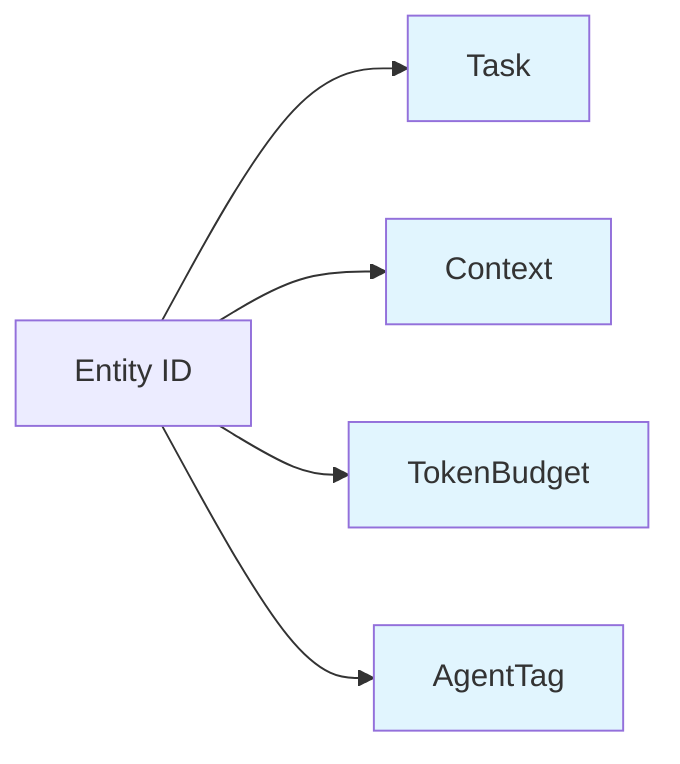
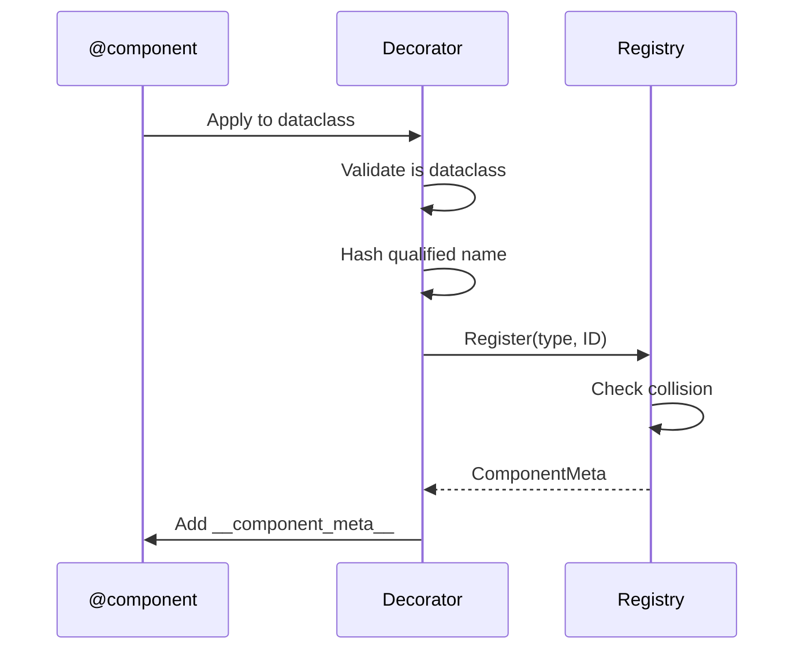
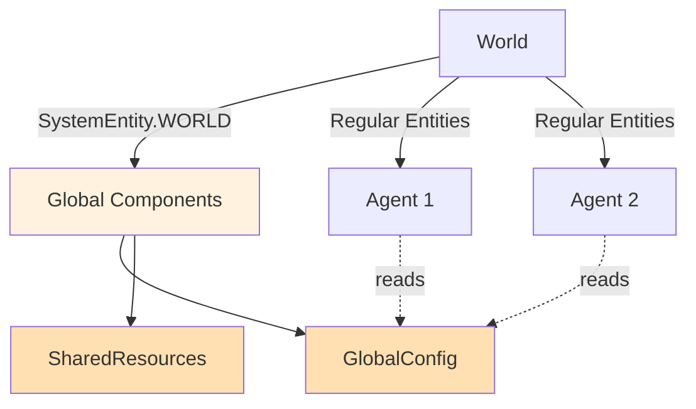

# Components

Components are pure data structures that define what an entity *is*. They contain no logic themselves—all behavior comes from [Systems](systems.md) that operate on entities with specific component combinations.

## Overview

In AgentECS, components are the fundamental building blocks of entity state. An entity is simply a unique ID plus a collection of components. By attaching different combinations of components to entities, you create diverse agents with varying capabilities and characteristics.

**Key Characteristics:**

- **Data-Only**: Components are pure data containers (dataclasses or Pydantic models)
- **Composable**: Mix and match components to create different entity types
- **Deterministic IDs**: Same code produces same component IDs across nodes
- **Optional Protocols**: Components can opt-in to advanced operations (merge, split, diff, interpolate)



!!! tip "Component Composition"
    Entities with `Task + TokenBudget` behave differently from those with `Task + Context + AgentTag`. This composition is how AgentECS achieves flexibility without rigid class hierarchies.

## Basic Declaration

Components are defined using Python dataclasses or Pydantic models, decorated with `@component`:

```python
from dataclasses import dataclass
from agentecs import component

@component
@dataclass(slots=True)
class Task:
    description: str
    status: str

@component
@dataclass(slots=True)
class TokenBudget:
    available: int
    used: int

@component
@dataclass(slots=True)
class AgentTag:
    """Marker component identifying AI agents."""
    name: str
```

!!! warning "Decorator Order"
    **ALWAYS** apply `@component` decorator **AFTER** `@dataclass`:

    ```python
    @component       # ← Second
    @dataclass       # ← First
    class MyComponent:
        value: int
    ```

    The reverse order will raise a `TypeError`.

### What Happens During Registration

When you decorate a class with `@component`, AgentECS:

1. **Validates** the class is a dataclass or Pydantic model
2. **Generates a deterministic ID** via SHA256 hash of the fully qualified class name
3. **Registers** the mapping in a global registry
4. **Adds** `__component_meta__` attribute to the class



### Using Pydantic Models

Components can also be Pydantic models for automatic validation:

```python
from pydantic import BaseModel, Field
from agentecs import component

@component
class AgentConfig(BaseModel):
    temperature: float = Field(gt=0, le=2.0)
    max_tokens: int = Field(gt=0, le=4096)
    model_name: str
```

!!! info "Optional Dependency"
    Pydantic is not required for AgentECS core functionality. Install with: `pip install agentecs[config]`

## Advanced Features: Component Protocols

Components can optionally implement **operation protocols** to support advanced features like entity merging, splitting, and interpolation. These protocols are entirely optional—components work fine without them.

### How to use Component Protocols

Protocols are defined as runtime-checkable interfaces. Simply implement the required methods on your component class:

```python
from typing import Self

@component
@dataclass(slots=True)
class TokenBudget:
    available: int
    used: int

    def __merge__(self, other: Self) -> Self:
        """Merge by combining budgets."""
        return TokenBudget(
            available=self.available + other.available,
            used=self.used + other.used
        )

    def __split__(self, ratio: float = 0.5) -> tuple[Self, Self]:
        """Split budget by ratio."""
        left_available = int(self.available * ratio)
        right_available = self.available - left_available
        return (
            TokenBudget(left_available, 0),
            TokenBudget(right_available, 0)
        )
```

Available protocols:

<div class="grid cards" markdown>

- :material-call-merge: **Mergeable**

    `__merge__(self, other: Self) -> Self`

    Combine two component instances into one (for agent merging)

- :material-call-split: **Splittable**

    `__split__(self, ratio: float) -> tuple[Self, Self]`

    Divide one component into two instances (for agent splitting)

- :material-function-variant: **Reducible**

    `__reduce_many__(cls, items: list[Self]) -> Self`

    Aggregate N instances into one (classmethod)

- :material-delta: **Diffable**

    `__diff__(self, baseline: Self) -> Self`
    `__apply_diff__(self, diff: Self) -> Self`

    Compute and apply deltas (for synchronization)

- :material-gradient-horizontal: **Interpolatable**

    `__interpolate__(self, other: Self, t: float) -> Self`

    Blend between two instances (for smooth transitions)

</div>

### Mergeable Components

The `Mergeable` protocol enables components to define how they combine during entity merges:

```python
@component
@dataclass(slots=True)
class Position:
    x: float
    y: float

    def __merge__(self, other: "Position") -> "Position":
        """Merge by averaging positions."""
        return Position(
            x=(self.x + other.x) / 2,
            y=(self.y + other.y) / 2
        )

@component
@dataclass(slots=True)
class Memory:
    facts: list[str]

    def __merge__(self, other: "Memory") -> "Memory":
        """Merge by combining unique facts."""
        return Memory(facts=list(set(self.facts + other.facts)))
```

**Usage in Entity Merging:**

```python
from agentecs import NonMergeableHandling

# Merge two agents - Mergeable components use __merge__
merged = world.merge_entities(
    agent1,
    agent2,
    on_non_mergeable=NonMergeableHandling.FIRST  # Strategy for non-mergeable
)
```

!!! info "Non-Mergeable Strategies"
    Components without `__merge__` use fallback strategies:

    - `ERROR`: Raise TypeError
    - `FIRST`: Keep component from first entity
    - `SECOND`: Keep component from second entity
    - `SKIP`: Exclude from merged entity

### Splittable Components

The `Splittable` protocol enables components to divide during entity splits:

```python
@component
@dataclass(slots=True)
class Credits:
    amount: float

    def __split__(self, ratio: float = 0.5) -> tuple["Credits", "Credits"]:
        """Split credits proportionally."""
        left_amount = self.amount * ratio
        right_amount = self.amount * (1 - ratio)
        return Credits(left_amount), Credits(right_amount)

@component
@dataclass(slots=True)
class Task:
    items: list[str]

    def __split__(self, ratio: float = 0.5) -> tuple["Task", "Task"]:
        """Split task list."""
        split_point = int(len(self.items) * ratio)
        return Task(self.items[:split_point]), Task(self.items[split_point:])
```

**Usage in Entity Splitting:**

```python
from agentecs import NonSplittableHandling

# Split agent 70/30
left, right = world.split_entity(
    agent,
    ratio=0.7,
    on_non_splittable=NonSplittableHandling.BOTH  # Clone to both
)
```

!!! info "Non-Splittable Strategies"
    Components without `__split__` use fallback strategies:

    - `ERROR`: Raise TypeError
    - `FIRST`: Give component only to first entity
    - `BOTH`: Deep copy to both entities
    - `SKIP`: Exclude from both entities

### Reducible Components

The `Reducible` protocol aggregates N components into one:

```python
@component
@dataclass(slots=True)
class Vote:
    choice: str
    weight: float = 1.0

    @classmethod
    def __reduce_many__(cls, items: list["Vote"]) -> "Vote":
        """Aggregate votes by weighted majority."""
        weights = {}
        for vote in items:
            weights[vote.choice] = weights.get(vote.choice, 0) + vote.weight
        winner = max(weights, key=weights.get)
        return Vote(choice=winner, weight=sum(weights.values()))
```

!!! note "Reducible is a Classmethod"
    Unlike other protocols, `__reduce_many__` is a classmethod that takes a list of instances.

!!! tip "Fallback to Merge"
    If a component implements `Mergeable` but not `Reducible`, AgentECS automatically reduces via sequential pairwise merging.

### Diffable Components

!!! info "Future Feature"
    The `Diffable` protocol is defined but not yet used by the framework. It will enable efficient delta synchronization in distributed scenarios.

```python
@component
@dataclass(slots=True)
class BeliefState:
    beliefs: dict[str, float]

    def __diff__(self, baseline: "BeliefState") -> "BeliefState":
        """Compute delta."""
        changes = {}
        for key, value in self.beliefs.items():
            if key not in baseline.beliefs or baseline.beliefs[key] != value:
                changes[key] = value
        return BeliefState(beliefs=changes)

    def __apply_diff__(self, diff: "BeliefState") -> "BeliefState":
        """Apply delta."""
        new_beliefs = self.beliefs.copy()
        new_beliefs.update(diff.beliefs)
        return BeliefState(beliefs=new_beliefs)
```

### Interpolatable Components

The `Interpolatable` protocol enables smooth transitions between component states:

```python
@component
@dataclass(slots=True)
class Position:
    x: float
    y: float

    def __interpolate__(self, other: "Position", t: float) -> "Position":
        """Linearly interpolate between positions."""
        return Position(
            x=self.x + (other.x - self.x) * t,
            y=self.y + (other.y - self.y) * t
        )
```

!!! example "Use Case: Smooth Movement"
    Interpolation is useful for smooth rendering, animation, or gradual state transitions in simulations.

## Global Components (Singletons)

AgentECS provides reserved singleton entities for global state:

- **`SystemEntity.WORLD`**: Global world configuration and parameters
- **`SystemEntity.CLOCK`**: Tick counter and timing information

```python
from agentecs import SystemEntity

# Set global configuration
world.set_singleton(GlobalConfig(temperature=0.7))

# Read global configuration in a system
config = world.singleton(GlobalConfig)
if config:
    print(f"Temperature: {config.temperature}")
```



!!! tip "When to Use Singletons"
    Use singleton components for:

    - Global configuration parameters
    - Shared resources (LLM clients, databases)
    - Environment state (temperature, pressure)
    - Tick counters and timing

    Avoid for entity-specific data—use regular components instead.

## Component Best Practices

!!! tip "Keep Components Small"
    Prefer many small, focused components over few large ones. Small components are more reusable and enable fine-grained system access patterns.

    **Good**: `Task`, `Context`, `TokenBudget`, `AgentTag`

    **Avoid**: `EntityState` with 20 fields

!!! tip "Use slots=True"
    For better memory efficiency, use `@dataclass(slots=True)` or `@dataclass(slots=True, frozen=True)` for immutable components.

!!! warning "Avoid Side Effects"
    Component methods (like `__merge__` or `__split__`) should be pure functions with no side effects. They should not modify external state or perform I/O.

!!! info "Deterministic IDs"
    Component IDs are derived from the fully qualified class name. This means:

    - Same code = same IDs across different processes/nodes
    - Renaming a component class changes its ID
    - Moving a component to a different module changes its ID

## See Also

- **[Systems](systems.md)**: How to define logic that operates on components
- **[World Management](world_management.md)**: Entity lifecycle and merging/splitting
- **[Storage](storage.md)**: How components are stored and queried
