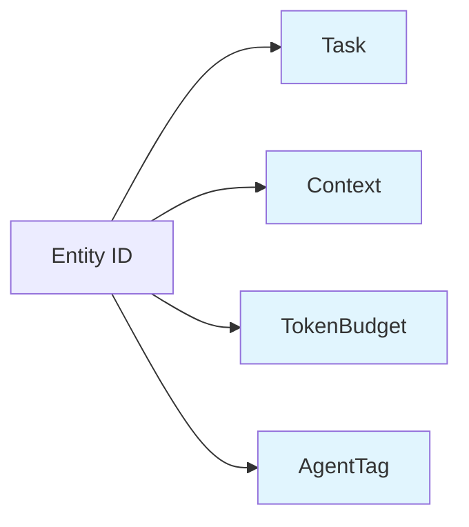
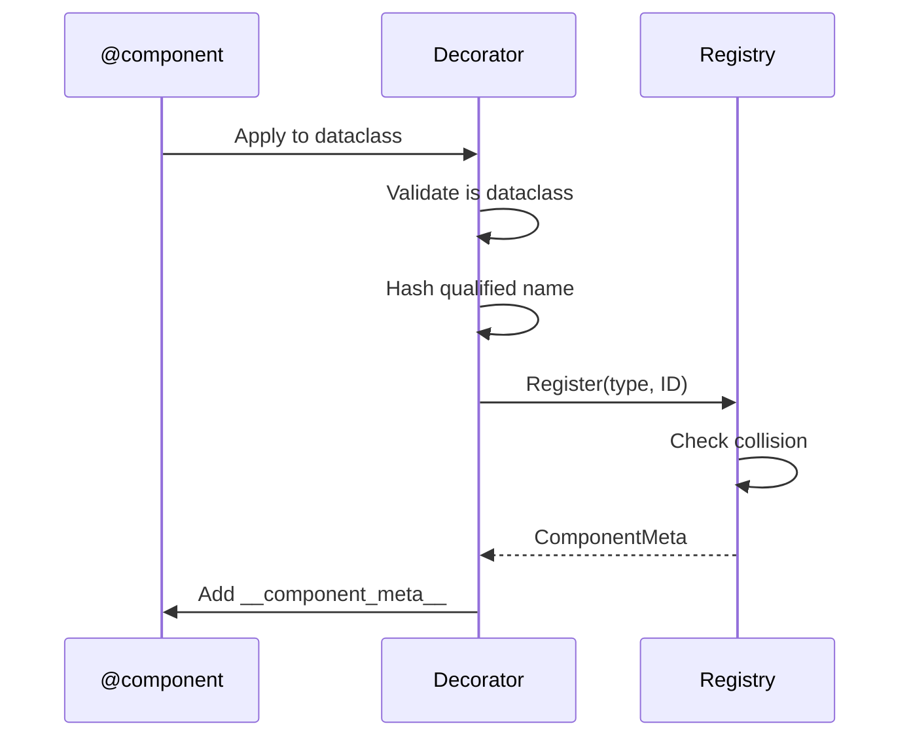
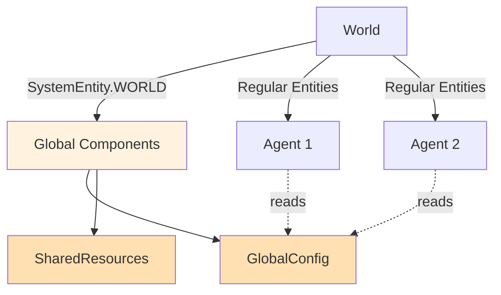

# Components

Components are pure data structures that define what an entity *is*. They contain no logic themselves—all behavior comes from [Systems](systems.md) that operate on entities with specific component combinations.

## Overview

In AgentECS, components are the fundamental building blocks of entity state. An entity is simply a unique ID plus a collection of components. By attaching different combinations of components to entities, you create diverse agents with varying capabilities and characteristics.

**Key Characteristics:**

- **Data-Only**: Components are pure data containers (dataclasses or Pydantic models)
- **Composable**: Mix and match components to create different entity types
- **Deterministic IDs**: Same code produces same component IDs across nodes
- **Optional Protocols**: Components can opt-in to combining and splitting behaviors



!!! tip "Component Composition"
    Entities with `Task + TokenBudget` behave differently from those with `Task + Context + AgentTag`. This composition is how AgentECS achieves flexibility without rigid class hierarchies.

## Basic Declaration

Components are defined using Python dataclasses or Pydantic models, decorated with `@component`:

```python
from dataclasses import dataclass
from agentecs import component

@component
@dataclass(slots=True)
class Task:
    description: str
    status: str

@component
@dataclass(slots=True)
class TokenBudget:
    available: int
    used: int

@component
@dataclass(slots=True)
class AgentTag:
    """Marker component identifying AI agents."""
    name: str
```

!!! warning "Decorator Order"
    **ALWAYS** apply `@component` decorator **AFTER** `@dataclass`:

    ```python
    @component       # ← Second
    @dataclass       # ← First
    class MyComponent:
        value: int
    ```

    The reverse order will raise a `TypeError`.

### Shared Components (Wrapper-Based)

AgentECS supports explicit shared component storage through the `Shared(...)` wrapper.

```python
from dataclasses import dataclass
from agentecs import World, component
from agentecs.core.component import Shared

@component
@dataclass(slots=True)
class PromptTemplate:
    text: str

world = World()
shared_template = Shared(PromptTemplate("You are a helpful assistant."))

agent_a = world.spawn(shared_template)
agent_b = world.spawn(shared_template)
```

Use this when multiple entities should reference the same backing component instance in storage.

!!! note
    Sharing is wrapper-only. `@component(shared=True)` is not supported.

### What Happens During Registration

When you decorate a class with `@component`, AgentECS:

1. **Validates** the class is a dataclass or Pydantic model
2. **Generates a deterministic ID** via SHA256 hash of the fully qualified class name
3. **Registers** the mapping in a global registry
4. **Adds** `__component_meta__` attribute to the class



### Using Pydantic Models

Components can also be Pydantic models for automatic validation:

```python
from pydantic import BaseModel, Field
from agentecs import component

@component
class AgentConfig(BaseModel):
    temperature: float = Field(gt=0, le=2.0)
    max_tokens: int = Field(gt=0, le=4096)
    model_name: str
```

!!! info "Optional Dependency"
    Pydantic is not required for AgentECS core functionality. Install with: `pip install agentecs[config]`

## Advanced Features: Component Protocols

Components can optionally implement operation protocols to participate in merge/split workflows.

AgentECS currently has two optional protocols:

<div class="grid cards" markdown>

- :material-call-merge: **Combinable**

    `__combine__(self, other: Self) -> Self`

    Used when multiple values for the same `(entity, component type)` must be combined.

- :material-call-split: **Splittable**

    `__split__(self) -> tuple[Self, Self]`

    Used when one entity is split into two entities.

</div>

Everything else uses framework defaults:

- Non-combinable values use last-writer-wins.
- Non-splittable values are deep-copied to both split entities.

### Combinable Components

```python
@component
@dataclass(slots=True)
class Credits:
    amount: float

    def __combine__(self, other: "Credits") -> "Credits":
        return Credits(self.amount + other.amount)

@component
@dataclass(slots=True)
class Position:
    x: float
    y: float

    def __combine__(self, other: "Position") -> "Position":
        return Position(
            x=(self.x + other.x) / 2,
            y=(self.y + other.y) / 2,
        )
```

Use in entity merge:

```python
merged = world.merge_entities(agent1, agent2)
```

### Splittable Components

```python
@component
@dataclass(slots=True)
class Credits:
    amount: float

    def __split__(self) -> tuple["Credits", "Credits"]:
        half = self.amount / 2
        return Credits(half), Credits(self.amount - half)

@component
@dataclass(slots=True)
class TaskQueue:
    items: list[str]

    def __split__(self) -> tuple["TaskQueue", "TaskQueue"]:
        midpoint = len(self.items) // 2
        return TaskQueue(self.items[:midpoint]), TaskQueue(self.items[midpoint:])
```

Use in entity split:

```python
left, right = world.split_entity(agent)
```

## Global Components (Singletons)

AgentECS provides reserved singleton entities for global state:

- **`SystemEntity.WORLD`**: Global world configuration and parameters
- **`SystemEntity.CLOCK`**: Tick counter and timing information

```python
from agentecs import SystemEntity

# Set global configuration
world.set_singleton(GlobalConfig(temperature=0.7))

# Read global configuration outside systems
config = world.singleton_copy(GlobalConfig)
if config:
    print(f"Temperature: {config.temperature}")
```



!!! tip "When to Use Singletons"
    Use singleton components for:

    - Global configuration parameters
    - Shared resources (LLM clients, databases)
    - Environment state (temperature, pressure)
    - Tick counters and timing

    Avoid for entity-specific data—use regular components instead.

## Component Best Practices

!!! tip "Keep Components Small"
    Prefer many small, focused components over few large ones. Small components are more reusable and enable fine-grained system access patterns.

    **Good**: `Task`, `Context`, `TokenBudget`, `AgentTag`

    **Avoid**: `EntityState` with 20 fields

!!! tip "Use slots=True"
    For better memory efficiency, use `@dataclass(slots=True)` or `@dataclass(slots=True, frozen=True)` for immutable components.

!!! warning "Avoid Side Effects"
    Component methods (like `__combine__` or `__split__`) should be pure functions with no side effects. They should not modify external state or perform I/O.

!!! info "Deterministic IDs"
    Component IDs are derived from the fully qualified class name. This means:

    - Same code = same IDs across different processes/nodes
    - Renaming a component class changes its ID
    - Moving a component to a different module changes its ID

## See Also

- **[Systems](systems.md)**: How to define logic that operates on components
- **[World Management](world_management.md)**: Entity lifecycle and merging/splitting
- **[Storage](storage.md)**: How components are stored and queried
