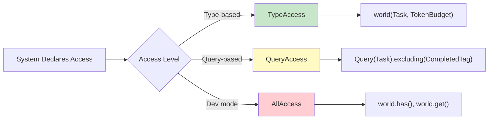
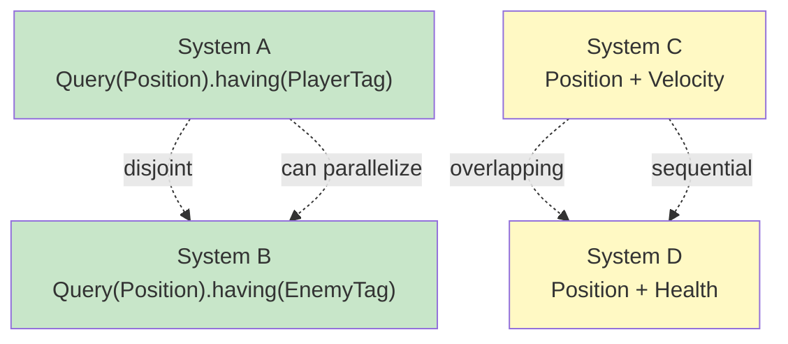

# Query and Access System

AgentECS provides a flexible query system for finding entities by their component combinations. Systems use queries to iterate over relevant entities efficiently.

## Overview

Queries enable systems to find and iterate over entities that match specific component patterns:



**Query Characteristics:**

- **Lazy Evaluation**: Queries return iterators, not lists—entities are fetched on demand
- **Type-Safe**: Component types are checked at runtime
- **Buffer-Aware**: Queries see write buffer changes from current system
- **Snapshot Isolated**: Queries don't see other systems' writes until tick boundary

## Basic Query Syntax

### Type-Based Queries

Query entities by specifying component types. Results unpack to `(entity, component1, component2, ...)` tuples:

!!! warning "Query Results are Copies"
    All query results return **deep copies** of components. Mutations to `pos` or `vel` won't persist unless you write them back via `world[entity, Type] = value`.

```python
@system(reads=(Task, TokenBudget), writes=(Task, TokenBudget))
def process_tasks(world: ScopedAccess) -> None:
    # Multi-component query
    for entity, task, budget in world(Task, TokenBudget):
        # task and budget are copies - must write back changes
        if task.status == "pending" and budget.available >= 100:
            world[entity, Task] = Task(task.description, "completed")
            world[entity, TokenBudget] = TokenBudget(
                available=budget.available - 100,
                used=budget.used + 100
            )

    # Single component
    for entity, budget in world(TokenBudget):
        if budget.available < 100:
            print(f"Entity {entity} is low on tokens")
```

**Query multiple combinations within one system:**

```python
@system(reads=(Task, TokenBudget, Context), writes=(Task, Context))
def agent_workflow(world: ScopedAccess) -> None:
    # Query different combinations as needed
    for entity, task, budget, ctx in world(Task, TokenBudget, Context):
        # Process entities with all three components
        pass

    for entity, task, ctx in world(Task, Context):
        # Process entities with Task + Context
        pass
```

!!! tip "Query Returns What You Ask For"
    `world(A, B)` only returns entities that have **BOTH** A and B. It's an AND operation, not OR.

### Dev Mode Access

Dev mode systems have unrestricted access without declaring reads/writes:

```python
@system.dev()
def debug_inspector(world: ScopedAccess) -> None:
    """Inspect all entities without restrictions."""
    for entity in world:
        if world.has(entity, Position):
            pos = world[entity, Position]
            print(f"Entity {entity} at ({pos.x}, {pos.y})")
```

!!! warning "Dev Mode Trade-offs"
    - **Pros**: No access restrictions, flexible debugging
    - **Cons**: Runs in isolation (cannot parallelize), no validation

    Use for debugging only—add proper access patterns for production.

## Query Result Methods

Query results provide methods for common operations:

**`.entities()` - Iterate just Entity IDs:**

```python
@system.dev()
def count_entities(world: ScopedAccess) -> None:
    # Skip component unpacking, just get IDs
    agent_ids = list(world(Position, AgentTag).entities())
    print(f"Found {len(agent_ids)} agents")
```

**`len()` - Count matches:**

```python
@system.dev()
def stats(world: ScopedAccess) -> None:
    moving_count = len(world(Position, Velocity))
    total_count = len(world(Position))
    print(f"{moving_count}/{total_count} entities moving")
```

!!! warning "len() Consumes Iterator"
    Calling `len()` iterates through all matches. If you need both count and entities, collect to a list first:

    ```python
    entities = list(world(Position, Velocity))
    count = len(entities)
    ```

## Advanced Filtering

### Query Objects with having() and excluding()

Use `Query` objects for fine-grained filtering:

```python
from agentecs import Query

@system(
    reads=Query(Position, Velocity).having(ActiveTag).excluding(FrozenTag),
    writes=Query(Position),
)
def active_movement(world: ScopedAccess) -> None:
    """Move entities that are active but not frozen."""
    # Query returns entities with Position, Velocity, ActiveTag, but NOT FrozenTag
    for entity, pos, vel, active in world(Position, Velocity, ActiveTag):
        world[entity, Position] = Position(pos.x + vel.dx, pos.y + vel.dy)
```

**Combining multiple filters:**

```python
@system(
    reads=Query(Position, Health)
        .having(EnemyTag)
        .excluding(DeadTag, InvulnerableTag),
    writes=Query(Health).having(EnemyTag),
)
def damage_living_enemies(world: ScopedAccess) -> None:
    """Damage enemies that are alive and vulnerable."""
    for entity, pos, health, enemy in world(Position, Health, EnemyTag):
        world[entity, Health] = Health(health.hp - 10, health.max_hp)
```

!!! tip "Excluding vs. Runtime Checks"
    `.excluding()` filters at the storage level, avoiding unnecessary component fetches:

    ```python
    # Efficient - excludes at storage level
    @system(reads=Query(Position).excluding(Frozen))

    # Less efficient - checks every Position entity
    @system(reads=(Position,))
    def move(world):
        for entity, pos in world(Position):
            if not world.has(entity, Frozen):  # Runtime check
                ...
    ```

!!! info "Query Methods are Immutable"
    `.having()` and `.excluding()` return **new** Query objects:

    ```python
    base = Query(Position)
    with_vel = base.having(Velocity)  # New query
    # base is still Query(Position)
    ```

### Archetype Matching

Query objects can test if an archetype (set of component types) matches:

```python
from agentecs import Query

# Define query
q = Query(Position, Velocity).having(Health).excluding(FrozenTag)

# Test archetypes
archetype1 = frozenset({Position, Velocity, Health})
archetype2 = frozenset({Position, Velocity, Health, FrozenTag})

print(q.matches_archetype(archetype1))  # True
print(q.matches_archetype(archetype2))  # False (has FrozenTag)
```

!!! info "Used for Optimization"
    Archetype matching is used internally for query disjointness detection. Future archetypal storage backends will use this for O(matched entities) queries.

### Field-Level Filtering (Future)

!!! info "Future Feature"
    Field-level filtering is planned. Currently, filter at query time:

    ```python
    @system(reads=(Position,), writes=())
    def entities_past_x100(world: ScopedAccess) -> None:
        for entity, pos in world(Position):
            if pos.x > 100:
                # Process entity
                pass
    ```

## Performance Considerations

!!! tip "Narrow Your Queries"
    More component types = fewer matches = faster:

    - `world(Position)` → Many matches
    - `world(Position, Velocity)` → Fewer matches
    - `world(Position, Velocity, AIAgent, Health)` → Very few matches

!!! warning "Avoid Materializing Large Results"
    Queries are lazy iterators. Don't collect to lists unnecessarily:

    ```python
    # Good - processes one at a time
    for entity, pos in world(Position):
        process(entity, pos)

    # Avoid - materializes all at once
    all_entities = list(world(Position))
    for entity, pos in all_entities:
        process(entity, pos)
    ```

## Query Disjointness and Parallelization

The scheduler uses query disjointness to enable parallelization:



**How Disjointness Works:**

Two queries are disjoint if they can never match the same entity:

```python
# Disjoint - can parallelize even though both write Position
@system(writes=Query(Position).having(PlayerTag))
@system(writes=Query(Position).having(EnemyTag))
# PlayerTag and EnemyTag are mutually exclusive

# Overlapping - runs sequentially
@system(writes=(Position,))  # All Position entities
@system(writes=(Position,))  # All Position entities
```

!!! info "Conservative Analysis"
    The scheduler assumes queries overlap unless it can prove they're disjoint.

## Direct Component Access

Beyond queries, `ScopedAccess` provides direct component access:

```python
@system.dev()
def direct_access(world: ScopedAccess) -> None:
    entity = some_entity_id

    # Get component
    pos = world[entity, Position]

    # Set component (buffered)
    world[entity, Position] = Position(10, 20)

    # Delete component (buffered)
    del world[entity, Velocity]

    # Check membership
    if (entity, Health) in world:
        print("Has Health")

    # Has component (alternative)
    if world.has(entity, Position):
        print("Has Position")
```

**EntityHandle for repeated access:**

```python
@system.dev()
def entity_handle_usage(world: ScopedAccess) -> None:
    e = world.entity(some_entity_id)

    # Dict-style operations
    e[Position] = Position(5, 5)
    pos = e[Position]
    del e[Velocity]

    if Health in e:
        print("Has health")
```

!!! tip "When to Use EntityHandle"
    Use `EntityHandle` when accessing multiple components on the same entity. It's more ergonomic than repeated `world[entity, Type]` calls.

## Access Control

AgentECS enforces access patterns at runtime:

```python
@system(reads=(Position,), writes=(Velocity,))
def illegal_access(world: ScopedAccess) -> None:
    for entity, pos in world(Position):
        # This will raise AccessViolationError!
        health = world[entity, Health]  # Health not in reads
```

!!! warning "Access Violations"
    Accessing undeclared component types raises `AccessViolationError` (except in dev mode). This provides runtime validation and helps document system dependencies.

## See Also

- **[Systems](systems.md)**: How to declare and use queries in systems
- **[World Management](world_management.md)**: Entity and component lifecycle
- **[Scheduling](scheduling.md)**: How snapshot isolation and merge strategies work
- **[Storage](storage.md)**: How queries are implemented at the storage level
