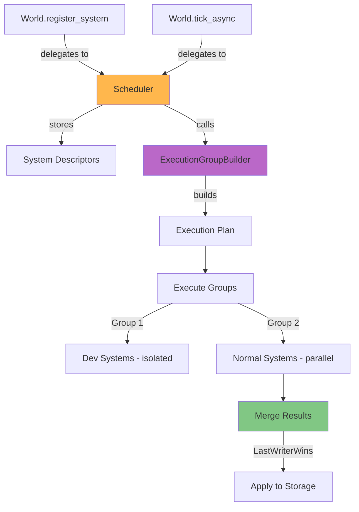
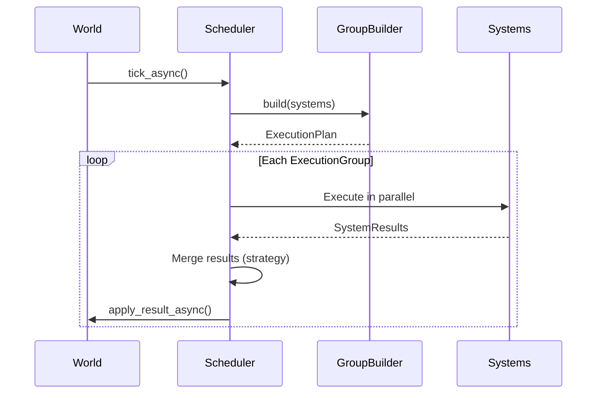

# Scheduling

Schedulers orchestrate system execution, determining which systems run, in what order, and how their results are merged. AgentECS provides a pluggable scheduling architecture with snapshot isolation and configurable merge strategies.

## Overview

The scheduler is the brain of AgentECS execution. It manages execution groups, handles parallelism, and merges results using configurable strategies.

**Scheduler Responsibilities:**

- **System Registration**: Collect system descriptors as they're registered
- **Execution Planning**: Build execution groups (via ExecutionGroupBuilder)
- **Execution Orchestration**: Run systems (sequentially or in parallel)
- **Result Merging**: Combine results using configured merge strategy
- **Result Application**: Apply changes to storage at group boundaries



## Core Concepts

### Snapshot Isolation

All systems within an execution group see the same initial state. Changes are buffered during execution and applied at group boundaries.

```python
# Both systems see Counter(0), even though they both write to it
@system(reads=(Counter,), writes=(Counter,))
def add_one(access):
    for e, c in access(Counter):
        access[e, Counter] = Counter(c.value + 1)  # Sees 0, writes 1

@system(reads=(Counter,), writes=(Counter,))
def add_ten(access):
    for e, c in access(Counter):
        access[e, Counter] = Counter(c.value + 10)  # Sees 0, writes 10

# After tick: Counter = 10 (LastWriterWins, add_ten registered second)
```

### Merge Strategies

When multiple systems write to the same (entity, component), the merge strategy determines the final value:

| Strategy | Behavior | Use Case |
|----------|----------|----------|
| `LAST_WRITER_WINS` | Later system (by registration) overwrites | Default, simple, deterministic |
| `MERGEABLE_FIRST` | Use `__merge__` if available, else overwrite | Semantic merging (counters, aggregations) |
| `ERROR` | Raise `ConflictError` on conflict | Debugging, catching unintended overwrites |

```python
from agentecs import World, MergeStrategy, SchedulerConfig
from agentecs.scheduling import SimpleScheduler

# Configure merge strategy
world = World(
    execution=SimpleScheduler(
        config=SchedulerConfig(merge_strategy=MergeStrategy.MERGEABLE_FIRST)
    )
)
```

### Execution Groups

Systems are organized into execution groups. Groups execute sequentially; systems within groups execute in parallel.


**Default Grouping (SingleGroupBuilder):**

- Dev mode systems (`@system.dev()`) each get their own group (run alone)
- All other systems go in one group (run in parallel)

## SimpleScheduler

The primary scheduler with parallel execution and configurable behavior.

```python
from agentecs import World, SchedulerConfig, MergeStrategy
from agentecs.scheduling import SimpleScheduler

# Default configuration
world = World(execution=SimpleScheduler())

# Full configuration
world = World(
    execution=SimpleScheduler(
        config=SchedulerConfig(
            merge_strategy=MergeStrategy.LAST_WRITER_WINS,
            max_concurrent=10,  # Limit parallel systems
            retry_policy=RetryPolicy(max_attempts=3)
        )
    )
)
```

### Configuration Options

#### Merge Strategy

```python
from agentecs import MergeStrategy, SchedulerConfig

# Default: later registration wins
config = SchedulerConfig(merge_strategy=MergeStrategy.LAST_WRITER_WINS)

# Use Mergeable protocol when available
config = SchedulerConfig(merge_strategy=MergeStrategy.MERGEABLE_FIRST)

# Error on conflicts (useful for debugging)
config = SchedulerConfig(merge_strategy=MergeStrategy.ERROR)
```

#### Concurrency Limiting

Useful for systems that call external APIs with rate limits:

```python
# Limit to 5 concurrent system executions
config = SchedulerConfig(max_concurrent=5)
```

#### Retry Policy

Handle transient failures (e.g., API timeouts):

```python
from agentecs.scheduling import RetryPolicy

config = SchedulerConfig(
    retry_policy=RetryPolicy(
        max_attempts=3,
        backoff="exponential",  # or "linear", "none"
        base_delay=0.1,
        on_exhausted="skip"  # or "fail"
    )
)
```

## SequentialScheduler

Alias for `SimpleScheduler` with `max_concurrent=1`. Useful for debugging.

```python
from agentecs.scheduling import SequentialScheduler

# These are equivalent:
world = World(execution=SequentialScheduler())
world = World(execution=SimpleScheduler(config=SchedulerConfig(max_concurrent=1)))
```

## ExecutionGroupBuilder

The extension point for custom grouping strategies. Implement this protocol to control how systems are grouped.

```python
from agentecs.scheduling import ExecutionGroupBuilder, ExecutionGroup, ExecutionPlan
from agentecs.core.system import SystemDescriptor

class CustomGroupBuilder:
    """Example: put each system in its own group (fully sequential)."""

    def build(self, systems: list[SystemDescriptor]) -> ExecutionPlan:
        return [ExecutionGroup(systems=[s]) for s in systems]

# Use custom builder
world = World(
    execution=SimpleScheduler(group_builder=CustomGroupBuilder())
)
```

### Built-in Builders

**SingleGroupBuilder** (default): All normal systems parallel, dev systems isolated.

```python
from agentecs.scheduling import SingleGroupBuilder

builder = SingleGroupBuilder()
# Dev systems → individual groups (run first, alone)
# Normal systems → one group (run in parallel)
```

### Future Builders (Planned)

| Builder | Purpose |
|---------|---------|
| `DependencyGroupBuilder` | Groups based on `depends_on` declarations |
| `FrequencyGroupBuilder` | Groups based on tick frequency |
| `ConditionGroupBuilder` | Groups based on runtime conditions |

## System Access Patterns

### Optional Declarations

Access declarations are optional. Systems without declarations have full access:

```python
# Full access, runs in parallel with others
@system()
def full_access_system(access):
    # Can read/write any component
    pass

# Declared access, validated at runtime
@system(reads=(Position,), writes=(Velocity,))
def movement(access):
    pass

# Dev mode: full access AND runs in isolation
@system.dev()
def debug_system(access):
    pass
```

Defaulting behavior:

- `@system()` -> full read/write access
- `@system(reads=(Position,))` -> reads `Position`, writes nothing
- `writes=()` -> explicit no-write access

!!! tip "When to Declare Access"
    - **Always declare** when you want validation and documentation
    - **Skip declarations** for quick prototyping or simple scripts
    - **Use dev mode** when debugging (runs alone, easier to reason about)

### Dev Mode Isolation

Dev mode systems run in their own execution group, seeing all previous changes:

```python
@system.dev()
def debug_system(access):
    # Runs alone, sees all changes from previous groups
    pass

@system(reads=(Counter,), writes=(Counter,))
def normal_system(access):
    # Runs in parallel with other normal systems
    pass

# Execution order:
# 1. debug_system (alone) → apply results
# 2. normal_system (parallel with others) → apply results
```

## Workflow: Inside tick_async()



**Step by step:**

1. **Build Plan**: GroupBuilder creates ExecutionPlan from registered systems
2. **Execute Groups**: For each group:
   - Execute all systems in parallel (with concurrency limit)
   - Retry failed systems per RetryPolicy
   - Merge results using MergeStrategy
   - Apply merged result to storage
3. **Next Group**: Subsequent groups see applied changes

## Distributed Scheduling (Future)

AgentECS is designed to support distributed execution:

### ExecutionBackend Protocol

```python
class ExecutionBackend(Protocol):
    async def execute_group(
        self, systems: list[SystemDescriptor], world: World
    ) -> list[SystemResult]:
        """Execute group across nodes."""
        ...
```

**Future backends:**

- **Ray Backend**: Distribute across Ray cluster
- **Dask Backend**: Use Dask for task scheduling

### Design Considerations

With merge-based conflict resolution (rather than conflict prevention), distributed execution becomes feasible:

- Systems execute independently on different nodes
- Results merge at coordinator
- Conflicts resolved by strategy, not prevented

!!! info "Distributed is Future Work"
    Current focus is local execution. The architecture supports distributed backends, but implementations are not yet built.

## Best Practices

!!! tip "Start Simple"
    Begin with `SimpleScheduler()` defaults. Only tune when profiling shows need.

!!! tip "Use Merge Strategies Wisely"
    - `LAST_WRITER_WINS`: Simple, deterministic, good default
    - `MERGEABLE_FIRST`: When you have semantic merge logic
    - `ERROR`: During development to catch unintended overlaps

!!! tip "Dev Mode for Debugging"
    Use `@system.dev()` when debugging. It runs in isolation, making it easier to reason about state.

!!! warning "Concurrency Limits for APIs"
    If systems call external APIs, use `max_concurrent` to respect rate limits:
    ```python
    config = SchedulerConfig(max_concurrent=5)
    ```

!!! info "Profile Before Optimizing"
    Parallelization has overhead. Profile to verify speedup:
    ```python
    import time
    start = time.time()
    await world.tick_async()
    print(f"Tick time: {time.time() - start:.3f}s")
    ```

## See Also

- **[Systems](systems.md)**: How to declare systems with access patterns
- **[World Management](world_management.md)**: How world delegates to scheduler
- **[Queries](queries.md)**: Query patterns and filtering
- **[Storage](storage.md)**: How storage backends interact with scheduling
