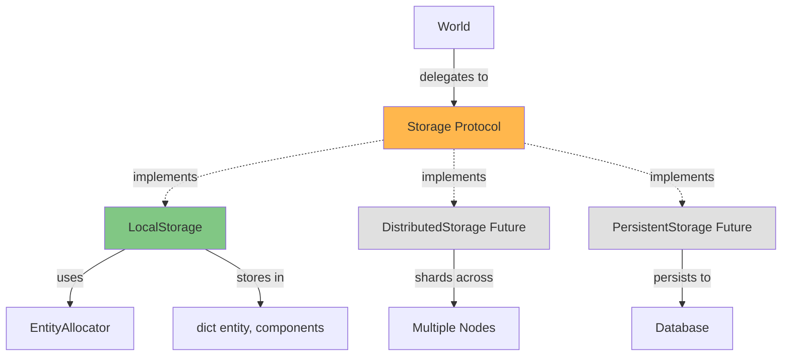
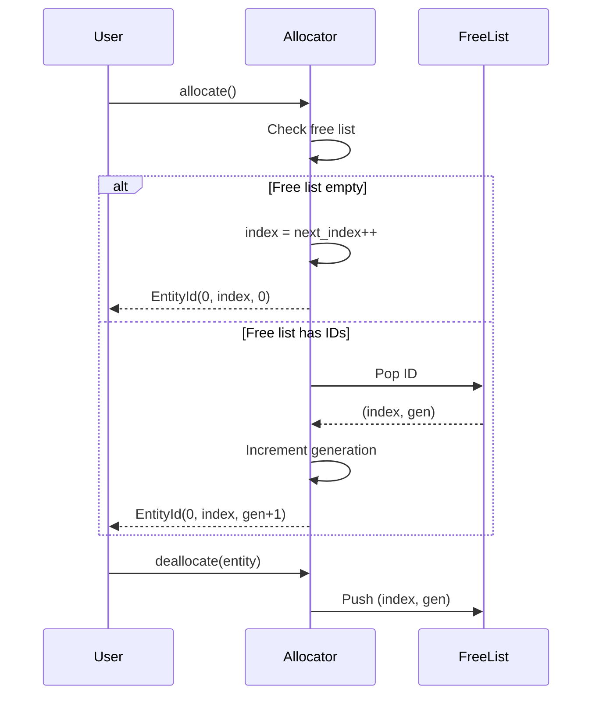

# Storage

Storage backends provide the persistence layer for entities and components in AgentECS. The pluggable storage architecture enables swapping implementations from simple in-memory storage to distributed, persistent, or specialized backends.

## Overview

The storage layer abstracts how entities and components are stored, queried, and updated. This separation from World and Scheduler enables:

- **Swappable Backends**: Change storage without touching game logic
- **Testing**: Mock storage for unit tests
- **Optimization**: Specialized storage for different workloads
- **Distribution**: Shard entities across nodes for scale



**Storage Responsibilities:**

- **Entity Lifecycle**: Create, destroy, check existence
- **Component Access**: Get, set, remove, check presence
- **Queries**: Find entities by component types
- **Batch Operations**: Apply multiple updates atomically
- **Serialization**: Snapshot and restore world state

## Storage Interface

The `Storage` protocol defines the contract all storage backends must implement:

### Entity Lifecycle Methods

**create_entity() → EntityId**

Allocate a new unique entity ID:

```python
entity = storage.create_entity()
# Returns: EntityId(shard=0, index=1, generation=0)
```

**destroy_entity(entity: EntityId) → None**

Remove an entity and all its components:

```python
storage.destroy_entity(entity)
# Entity no longer exists, components deleted
```

**entity_exists(entity: EntityId) → bool**

Check if an entity is alive:

```python
if storage.entity_exists(entity):
    print("Entity is alive")
```

!!! tip "Generational Indices"
    EntityIds include a generation counter. Even if an ID is recycled, the generation ensures old references don't accidentally access new entities.

**all_entities() → Iterator[EntityId]**

Iterate over all living entities:

```python
for entity in storage.all_entities():
    process(entity)
```

### Component Access Methods

**get_component(entity: EntityId, component_type: type[T]) → T | None**

Retrieve a component from an entity:

```python
pos = storage.get_component(entity, Position)
if pos:
    print(f"Position: ({pos.x}, {pos.y})")
```

**set_component(entity: EntityId, component: Any) → None**

Add or update a component on an entity:

```python
storage.set_component(entity, Position(10, 20))
# Component type inferred from instance
```

**remove_component(entity: EntityId, component_type: type) → bool**

Delete a component from an entity:

```python
removed = storage.remove_component(entity, Velocity)
if removed:
    print("Velocity component removed")
```

**has_component(entity: EntityId, component_type: type) → bool**

Check if entity has a specific component:

```python
if storage.has_component(entity, Health):
    print("Entity has Health")
```

**get_component_types(entity: EntityId) → frozenset[type]**

Get all component types on an entity:

```python
types = storage.get_component_types(entity)
print(f"Entity has: {[t.__name__ for t in types]}")
```

### Query Methods

**query(*component_types: type) → Iterator[tuple[EntityId, tuple[Any, ...]]]**

Find entities with all specified components:

```python
# Find entities with Position AND Velocity
for entity, (pos, vel) in storage.query(Position, Velocity):
    print(f"Entity {entity} at ({pos.x}, {pos.y})")
```

!!! info "Query Returns Tuples"
    `query()` returns `(entity, (comp1, comp2, ...))`. Components are in the same order as the query types.

**query_single(component_type: type[T]) → Iterator[tuple[EntityId, T]]**

Optimized query for a single component type:

```python
# Find all entities with Health
for entity, health in storage.query_single(Health):
    if health.hp < 10:
        print(f"Entity {entity} is low health")
```

### Batch Update Methods

**apply_updates(...) → list[EntityId]**

Apply multiple changes atomically:

```python
new_entities = storage.apply_updates(
    updates={entity1: {Position: Position(5, 5)}},
    inserts={entity2: [Velocity(1, 0)]},
    removes={entity3: [Health]},
    destroys=[entity4]
)
```

**Parameters:**

- `updates`: Modify existing components `{entity: {Type: component}}`
- `inserts`: Add new components `{entity: [component, ...]}`
- `removes`: Delete components `{entity: [Type, ...]}`
- `destroys`: Delete entities `[entity, ...]`

**Returns:** List of newly created EntityIds (for spawns)

!!! info "Atomic Application"
    All changes in a single `apply_updates` call are applied atomically. Either all succeed or none do (implementation-dependent).

### Serialization Methods

**snapshot() → bytes**

Serialize entire storage state:

```python
data = storage.snapshot()
with open("save.bin", "wb") as f:
    f.write(data)
```

**restore(data: bytes) → None**

Restore from snapshot:

```python
with open("save.bin", "rb") as f:
    data = f.read()
storage.restore(data)
```

!!! warning "Snapshot Format is Implementation-Specific"
    Different storage backends may use different serialization formats. Snapshots are not portable across implementations.

### Async Variants

For distributed or remote storage, async variants are provided:

```python
# Async query
async for entity, (pos, vel) in storage.query_async(Position, Velocity):
    process(entity, pos, vel)

# Async get
component = await storage.get_component_async(entity, Position)

# Async apply
new_entities = await storage.apply_updates_async(updates, inserts, removes, destroys)
```

!!! info "Local vs Remote Storage"
    LocalStorage provides both sync and async methods (async wraps sync). Remote storage implementations may only support async methods for network I/O.

## Entity Allocator

The EntityAllocator manages entity ID generation and recycling:

### Generational Indices

EntityIds use a three-part structure:

```python
@dataclass(frozen=True)
class EntityId:
    shard: int        # Which shard owns this entity (0 for local)
    index: int        # Unique index within shard
    generation: int   # Incremented on reuse
```



!!! tip "Prevents Stale References"
    If you hold an `EntityId` and the entity is destroyed then recreated, the generation counter ensures your old ID won't accidentally access the new entity:

    ```python
    entity1 = allocator.allocate()  # EntityId(0, 1, 0)
    allocator.deallocate(entity1)

    entity2 = allocator.allocate()  # EntityId(0, 1, 1)  ← Same index, different generation
    # entity1 != entity2 (generation differs)
    ```

### Allocator Methods

**allocate() → EntityId**

Allocate a new entity ID:

```python
entity = allocator.allocate()
```

**deallocate(entity: EntityId) → None**

Return entity ID to free list:

```python
allocator.deallocate(entity)
# ID can be recycled with incremented generation
```

**is_alive(entity: EntityId) → bool**

Check if entity ID is currently active:

```python
if allocator.is_alive(entity):
    # Entity exists and generation matches
    pass
```

!!! info "Liveness Check"
    `is_alive()` checks if the entity's generation matches the allocator's current generation for that index. Destroyed entities have mismatched generations.

### Sharding Support

The allocator supports sharding for distributed scenarios:

```python
# Shard 0 allocator
allocator0 = EntityAllocator(shard=0)
e1 = allocator0.allocate()  # EntityId(0, 1, 0)

# Shard 1 allocator
allocator1 = EntityAllocator(shard=1)
e2 = allocator1.allocate()  # EntityId(1, 1, 0)  ← Different shard
```

!!! info "Future: Distributed Allocation"
    Shards enable partitioning entities across nodes. Each node has its own allocator with a unique shard ID, preventing ID collisions.

## Built-in Storage Implementations

### Local Storage

`LocalStorage` is the default in-memory storage backend:

**Implementation:**

```python
class LocalStorage:
    def __init__(self, shard: int = 0):
        self._shard = shard
        self._allocator = EntityAllocator(shard=shard)
        self._components: dict[EntityId, dict[type, Any]] = {}
```

**Data Structure:**

```
_components = {
    EntityId(0, 1, 0): {
        Position: Position(10, 20),
        Velocity: Velocity(1, 0),
        Health: Health(100, 100)
    },
    EntityId(0, 2, 0): {
        Position: Position(5, 5),
        AgentTag: AgentTag("Alice")
    }
}
```

**Characteristics:**

<div class="grid cards" markdown>

- :material-check: **Simple**

    Dict-based, easy to understand and debug

- :material-speedometer: **Fast for Small Scale**

    Good performance for 100s-1000s of entities

- :material-memory: **High Memory**

    Stores all entities in memory, no persistence

- :material-search-web: **O(n) Queries**

    Must check every entity (no archetypal optimization)

</div>

**Usage:**

```python
from agentecs import World
from agentecs.storage import LocalStorage

# Default (shard 0)
world = World()

# Explicit local storage
world = World(storage=LocalStorage(shard=0))
```

**Serialization:**

Uses `pickle` for snapshot/restore:

```python
data = world.snapshot()  # Pickles _components dict
world.restore(data)      # Unpickles and restores
```

!!! warning "Pickle Security"
    LocalStorage uses `pickle` which is not secure for untrusted data. Only restore snapshots from trusted sources.

**Performance Characteristics:**

| Operation | Complexity | Notes |
|-----------|------------|-------|
| `create_entity()` | O(1) | Allocator amortized |
| `get_component()` | O(1) | Dict lookup |
| `set_component()` | O(1) | Dict insert |
| `query(*types)` | O(n×m) | n=entities, m=types |
| `apply_updates()` | O(k) | k=total changes |

!!! tip "Optimization Opportunity"
    Future: Implement archetypal storage where entities with the same component types are stored contiguously. This reduces queries from O(n×m) to O(matched entities).

### Remote Storage Options

!!! info "Future Feature"
    Remote storage backends for distributed or persistent scenarios:

    **PostgreSQL Backend:**

    ```python
    # Future API
    from agentecs.storage.postgres import PostgreSQLStorage

    storage = PostgreSQLStorage(
        connection_string="postgresql://localhost/agentecs"
    )
    world = World(storage=storage)
    ```

    - Persistent storage across runs
    - SQL queries for analytics
    - ACID transactions
    - Slower than in-memory

    **Redis Backend:**

    ```python
    # Future API
    from agentecs.storage.redis import RedisStorage

    storage = RedisStorage(host="localhost", port=6379)
    world = World(storage=storage)
    ```

    - In-memory with optional persistence
    - Fast read/write
    - Pub/sub for distributed scenarios
    - TTL for automatic cleanup

    **S3/Cloud Storage:**

    ```python
    # Future API
    from agentecs.storage.s3 import S3Storage

    storage = S3Storage(bucket="my-simulation-state")
    world = World(storage=storage)
    ```

    - Cheap persistent storage
    - Good for checkpointing
    - High latency (not for real-time)
    - Versioning support

### Distributed Storage

!!! info "Future Feature"
    Shard entities across multiple nodes:

    ```mermaid
    graph TD
        A[Coordinator] -->|manages| B[Storage Shard 0]
        A -->|manages| C[Storage Shard 1]
        A -->|manages| D[Storage Shard 2]

        B -->|stores| E[Entities 0-999]
        C -->|stores| F[Entities 1000-1999]
        D -->|stores| G[Entities 2000-2999]

        H[System] -.queries.-> B
        H -.queries.-> C
        H -.queries.-> D

        style A fill:#ffb74d
        style B fill:#81c784
        style C fill:#81c784
        style D fill:#81c784
    ```

    **Sharding Strategies:**

    - **Hash-based**: `shard = hash(entity) % num_shards`
    - **Range-based**: `shard = entity.index // shard_size`
    - **Spatial**: Entities near each other on same shard (for locality)
    - **Component-based**: Shard by primary component type

    **Challenges:**

    - **Cross-shard queries**: Entity on shard A references component from shard B
    - **Load balancing**: Some shards may have more entities
    - **Consistency**: Distributed transactions or eventual consistency
    - **Network overhead**: Remote queries are slower than local

    **Example API:**

    ```python
    # Future API
    from agentecs.storage.distributed import DistributedStorage, HashSharding

    storage = DistributedStorage(
        shards=[
            ("node1:5000", 0),
            ("node2:5000", 1),
            ("node3:5000", 2)
        ],
        strategy=HashSharding()
    )

    world = World(storage=storage)
    ```

## Archetypal Storage Optimization

!!! info "Future Feature"
    Current LocalStorage is entity-first (dict of entities). Archetypal storage is component-first:

    **Entity-First (Current):**

    ```python
    {
        Entity1: {Position, Velocity, Health},
        Entity2: {Position, Velocity},
        Entity3: {Position, Health},
    }
    ```

    **Archetype-First (Future):**

    ```python
    {
        Archetype(Position, Velocity, Health): [Entity1],
        Archetype(Position, Velocity): [Entity2],
        Archetype(Position, Health): [Entity3],
    }
    ```

    **Benefits:**

    - **O(matched) Queries**: Only iterate entities with matching archetype
    - **Cache Locality**: Components stored contiguously in memory
    - **Batch Operations**: Process all entities with same archetype together

    **Trade-offs:**

    - More complex implementation
    - Component add/remove requires archetype change (slower)
    - Memory overhead for archetype tracking

    **When to Use:**

    - 10,000+ entities
    - Many entities share same component combinations
    - Query-heavy workloads

## Storage Best Practices

!!! tip "Start with LocalStorage"
    Begin with LocalStorage. Only move to distributed or persistent storage when profiling shows it's necessary.

!!! tip "Profile Query Patterns"
    Understand your query patterns before choosing storage:

    - Many queries, few updates → Archetypal storage
    - Frequent component changes → Entity-first storage
    - Need persistence → Database backend
    - Massive scale → Distributed storage

!!! warning "Beware of Cross-Shard Queries"
    In distributed scenarios, queries that span shards are expensive. Design component relationships to minimize cross-shard access.

!!! tip "Use Snapshots for Checkpointing"
    Periodic snapshots enable:

    - Crash recovery
    - Debugging (rewind to previous state)
    - A/B testing (fork simulation from snapshot)

!!! info "Consider Consistency Requirements"
    Different storage backends offer different consistency guarantees:

    - LocalStorage: Strong consistency (single node)
    - Distributed: Eventual consistency (requires conflict resolution)
    - Persistent: ACID transactions (slow but safe)

## Storage Protocol Example Implementation

Here's a minimal custom storage implementation:

```python
from agentecs.storage.protocol import Storage
from agentecs.core.identity import EntityId

class InMemoryStorage(Storage):
    """Simple in-memory storage (minimal implementation)."""

    def __init__(self):
        self._data: dict[EntityId, dict[type, Any]] = {}
        self._next_id = 0

    def create_entity(self) -> EntityId:
        entity = EntityId(0, self._next_id, 0)
        self._next_id += 1
        self._data[entity] = {}
        return entity

    def destroy_entity(self, entity: EntityId) -> None:
        if entity in self._data:
            del self._data[entity]

    def entity_exists(self, entity: EntityId) -> bool:
        return entity in self._data

    def get_component(self, entity: EntityId, component_type: type[T]) -> T | None:
        return self._data.get(entity, {}).get(component_type)

    def set_component(self, entity: EntityId, component: Any) -> None:
        if entity in self._data:
            self._data[entity][type(component)] = component

    # ... implement other protocol methods ...
```

Use custom storage:

```python
world = World(storage=InMemoryStorage())
```

## See Also

- **[World Management](world_management.md)**: How World interacts with storage
- **[Scheduling](scheduling.md)**: How storage affects scheduling decisions
- **[Queries](queries.md)**: How queries are executed against storage
- **[Components](components.md)**: What storage stores
