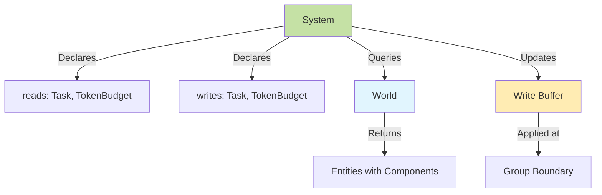
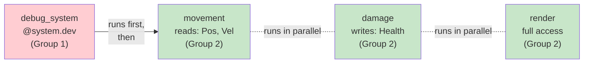

# Systems

Systems contain the logic that operates on entities with specific component combinations. While [Components](components.md) define *what* entities are, systems define *how* they behave.

## Overview

Systems are functions (or async functions) that query entities by their components and apply transformations. AgentECS uses access pattern declarations for validation and documentation, with optional declarations for flexibility.

**Key Characteristics:**

- **Function-Based**: Systems are decorated functions, not classes
- **Optional Declarations**: Declare `reads` and `writes` for validation, or omit for full access
- **Snapshot Isolation**: Systems in the same execution group see a consistent worldview
- **Async-First**: Systems can be sync or async, framework handles both seamlessly



!!! tip "Systems are Pure (Within an Execution Group)"
    Systems read from storage and write to a buffer. Changes aren't visible to other systems in the same group until the group boundary, enabling parallelization without race conditions. Subsequent groups see applied changes.

## Basic Declaration

Systems are defined using the `@system` decorator:

```python
from agentecs import system, ScopedAccess

@system(reads=(Task, TokenBudget), writes=(Task, TokenBudget))
def process_tasks(world: ScopedAccess) -> None:
    """Process tasks using available tokens."""
    for entity, task, budget in world(Task, TokenBudget):
        if task.status == "pending" and budget.available >= 100:
            world[entity, Task] = Task(task.description, "completed")
            world[entity, TokenBudget] = TokenBudget(
                available=budget.available - 100,
                used=budget.used + 100
            )
```

### System Function Signature

**Required Parameter:**
- `world: ScopedAccess` - Provides controlled access to the world

**Optional Return:**
- `None` - No explicit changes (use `world[entity, Type] = value`)
- `SystemResult` - Explicit result object
- `dict[EntityId, dict[type, Any]]` - Entity → components mapping
- `dict[EntityId, Any]` - Entity → single component (type inferred)
- `list[tuple[EntityId, Any]]` - List of (entity, component) pairs

=== "Direct Updates (Recommended)"

    ```python
    @system(reads=(Task, TokenBudget), writes=(Task, TokenBudget))
    def process_tasks(world: ScopedAccess) -> None:
        for entity, task, budget in world(Task, TokenBudget):
            if task.status == "pending" and budget.available >= 100:
                world[entity, Task] = Task(task.description, "completed")
                world[entity, TokenBudget] = TokenBudget(
                    available=budget.available - 100,
                    used=budget.used + 100
                )
    ```

=== "Dict Return"

    ```python
    @system(reads=(Task, TokenBudget), writes=(Task, TokenBudget))
    def process_tasks(world: ScopedAccess) -> dict[EntityId, dict[type, Any]]:
        return {
            entity: {
                Task: Task(task.description, "completed"),
                TokenBudget: TokenBudget(budget.available - 100, budget.used + 100)
            }
            for entity, task, budget in world(Task, TokenBudget)
            if task.status == "pending" and budget.available >= 100
        }
    ```

=== "SystemResult Return"

    ```python
    from agentecs import SystemResult

    @system(reads=(Task, TokenBudget), writes=(Task, TokenBudget))
    def process_tasks(world: ScopedAccess) -> SystemResult:
        result = SystemResult()
        for entity, task, budget in world(Task, TokenBudget):
            if task.status == "pending" and budget.available >= 100:
                if entity not in result.updates:
                    result.updates[entity] = {}
                result.updates[entity][Task] = Task(task.description, "completed")
                result.updates[entity][TokenBudget] = TokenBudget(
                    available=budget.available - 100,
                    used=budget.used + 100
                )
        return result
    ```

!!! tip "Prefer Direct Updates"
    Using `world[entity, Type] = value` is more ergonomic and readable than returning dicts or SystemResult objects. Save return values for pure systems or when you need fine-grained control.

### Access Pattern Declaration

Systems can optionally declare which component types they read and write:

```python
@system(
    reads=(Task, TokenBudget, Context),  # Can read these types
    writes=(Task, Context),              # Can write these types
)
def my_system(world: ScopedAccess) -> None:
    pass
```

**Access Declarations Are Optional**

For quick prototyping, omit declarations entirely:

```python
@system()  # Full access, runs in parallel with other systems
def quick_prototype(world: ScopedAccess) -> None:
    # Can read/write any component
    pass
```

Defaulting rules are explicit:

- `@system()` (both omitted) -> full read and write access
- If one side is declared and the other omitted, the omitted side becomes no access
- `writes=()` is an explicit no-write declaration
- `@system.readonly()` defaults to full read access, writes are always blocked

!!! tip "When to Declare Access"
    - **Skip declarations** for quick prototyping or simple scripts
    - **Add declarations** when you want validation and documentation
    - **Use dev mode** when debugging (runs alone, easier to reason about)

!!! warning "Write Implies Read"
    If a system declares a type in `writes`, it automatically has read access to that type. You don't need to list it in both.

## Querying Entities and Components

Systems query entities using the `world(ComponentType, ...)` syntax:

### Query Syntax

**Basic Multi-Component Query:**

```python
@system(reads=(Task, TokenBudget), writes=(Task, TokenBudget))
def process_tasks(world: ScopedAccess) -> None:
    # Iterate entities with BOTH Task AND TokenBudget
    for entity, task, budget in world(Task, TokenBudget):
        # task and budget are copies - must write back changes
        if task.status == "pending" and budget.available >= 100:
            print(f"Entity {entity} processing: {task.description}")
            world[entity, Task] = Task(task.description, "completed")
            world[entity, TokenBudget] = TokenBudget(
                available=budget.available - 100,
                used=budget.used + 100
            )
```

**Single-Component Query:**

```python
@system(reads=(TokenBudget,), writes=(TokenBudget,))
def decay_budget(world: ScopedAccess) -> None:
    for entity, budget in world(TokenBudget):
        world[entity, TokenBudget] = TokenBudget(
            available=budget.available - 1,
            used=budget.used + 1
        )
```

**Entity Handle for Repeated Access:**

```python
@system(reads=(Position, Velocity, Health), writes=(Position, Health))
def complex_system(world: ScopedAccess) -> None:
    for entity_id, pos in world(Position):
        e = world.entity(entity_id)  # Get EntityHandle

        # Dict-style access
        if Velocity in e:
            vel = e[Velocity]
            e[Position] = Position(pos.x + vel.dx, pos.y + vel.dy)

        if Health in e:
            e[Health] = Health(e[Health].hp - 1, e[Health].max_hp)
```

!!! info "Query Returns Iterator"
    `world(Type1, Type2)` returns a `QueryResult` that yields `(entity, comp1, comp2)` tuples. It's lazy—entities are fetched on iteration.

## Updating Components

### All Reads Return Copies

**IMPORTANT:** All component reads return deep copies, not references.

```python
@system(reads=(Position, Velocity), writes=(Position,))
def movement(world: ScopedAccess) -> None:
    for entity, pos, vel in world(Position, Velocity):
        # pos and vel are COPIES - safe to mutate
        pos.x += vel.dx
        pos.y += vel.dy
        world[entity, Position] = pos  # Must write back!

        # Or create new instance (same effect):
        # world[entity, Position] = Position(pos.x + vel.dx, pos.y + vel.dy)
```

!!! warning "Must Write Back"
    Mutations to retrieved components do NOT persist automatically. You must write back via `world[entity, Type] = component`. This applies to all reads: `world[entity, Type]`, `world(Type)` queries, and `world.get(entity, Type)`.

!!! tip "Why Copies?"
    Returning copies prevents accidental mutation of world state, works with any storage backend (including remote/serialized), and maintains snapshot isolation guarantees.

### Updating Multiple Components

Update multiple components on the same entity:

```python
@system(reads=(Position, Velocity, Fuel), writes=(Position, Velocity, Fuel))
def movement_with_fuel(world: ScopedAccess) -> None:
    for entity, pos, vel, fuel in world(Position, Velocity, Fuel):
        if fuel.amount > 0:
            # Update multiple components
            world[entity, Position] = Position(pos.x + vel.dx, pos.y + vel.dy)
            world[entity, Fuel] = Fuel(fuel.amount - 1)
        else:
            # Stop moving when out of fuel
            world[entity, Velocity] = Velocity(0, 0)
```

### Updating via Return Values

For pure functional systems, return changes instead of writing to world:

```python
@system(reads=(Input,), writes=(Output,), mode=SystemMode.PURE)
def transform(world: ReadOnlyAccess) -> dict[EntityId, dict[type, Any]]:
    """Pure system - must return all changes."""
    return {
        entity: {Output: Output(inp.value * 2)}
        for entity, inp in world.query(Input)
    }
```

!!! note "SystemMode.PURE"
    Pure systems receive `ReadOnlyAccess` and must return all changes. They cannot use `world[entity, Type] = value`.

## Understanding Execution Behavior

### Access Levels

AgentECS provides three access levels:

<div class="grid cards" markdown>

- :material-lock-open: **Standard Access**

    ```python
    @system(reads=(A, B), writes=(C,))
    ```

    Type-level access. System can read A, B and write C. Runs in parallel with other systems.

- :material-lock-open-outline: **Full Access (Optional Declarations)**

    ```python
    @system()  # No reads/writes declared
    ```

    Unrestricted access. Still runs in parallel with other systems.

- :material-lock-off: **Dev Mode**

    ```python
    @system.dev()
    ```

    Unrestricted access AND runs in isolation. Use for debugging.

</div>

**How Access Affects Execution:**



!!! info "Snapshot Isolation and Merge Strategies"
    All systems in an execution group see the same initial state (snapshot isolation). When multiple systems write to the same entity/component, results are merged using configurable strategies:

    - **LastWriterWins** (default): Later system (by registration) overwrites earlier
    - **MergeableFirst**: Use `__merge__` method if available
    - **Error**: Raise exception on conflict (useful for debugging)

    See [Scheduling](scheduling.md) for details on merge strategies.

### When to Use Access Declarations

Access declarations are **optional** in AgentECS. Under snapshot isolation with merge strategies, correctness doesn't require declarations. Here's when each approach is appropriate:

| Approach | Syntax | Use When |
|----------|--------|----------|
| **No declarations** | `@system()` | Quick prototyping, scripts, simple systems |
| **With declarations** | `@system(reads=..., writes=...)` | Production code, team projects, complex systems |
| **Dev mode** | `@system.dev()` | Debugging, inspecting state, tracing issues |

**Benefits of Declaring Access:**

- **Runtime validation**: Catch accidental access to undeclared components
- **Documentation**: Declarations show intent at a glance
- **Future optimization**: Declarations enable smarter scheduling (planned)
- **Refactoring safety**: Easier to understand what a system touches

**When to Skip Declarations:**

- Rapid prototyping where you're still figuring out what components you need
- One-off scripts or experiments
- Systems that legitimately need access to many/all components (aggregators, debuggers)

```python
# Quick prototype - figure out what you need first
@system()
def experimental(world: ScopedAccess) -> None:
    for e, pos in world(Position):
        # Still exploring what else we need...
        if Health in world.entity(e):
            world[e, Health] = Health(100)

# Production - declare what you use
@system(reads=(Position, Health), writes=(Health,))
def production_ready(world: ScopedAccess) -> None:
    for e, pos, health in world(Position, Health):
        world[e, Health] = Health(100)
```

!!! tip "Gradual Adoption"
    Start with `@system()` to explore, then add declarations as your system stabilizes. This keeps iteration fast while enabling validation in production.

### Frequency

!!! info "Future Feature"
    `frequency` parameter exists but isn't yet used by scheduler:

    ```python
    @system(reads=(A,), writes=(B,), frequency=0.5)
    def every_other_tick(world: ScopedAccess) -> None:
        # Future: Run every 2 ticks
        pass
    ```

    Planned for frequency-based execution in a future release.

### Conditions

!!! info "Future Feature"
    Condition-based execution is planned but not yet implemented:

    ```python
    # Future API (not yet available)
    @system(reads=(Temperature,), writes=(Alert,),
            condition=lambda world: world.singleton(Temperature).value > 100)
    def overheat_alert(world: ScopedAccess) -> None:
        pass
    ```

### Dependencies

!!! info "Future Feature"
    Explicit dependencies are planned but not yet implemented:

    ```python
    # Future API (not yet available)
    @system(reads=(A,), writes=(B,), depends_on=[systemA, systemB])
    def dependent_system(world: ScopedAccess) -> None:
        # Runs after systemA and systemB
        pass
    ```

    Currently, use execution groups to control ordering. Dev mode systems run in separate groups before normal systems.

## Typical Workflows

AgentECS is extremely flexible in how systems can be defined. Here are common patterns to get started:

### Pattern-Match and execute per entity

Process each entity individually based on its components:

```python
@system(reads=(Position, Velocity, Health), writes=(Position, Health))
def entity_update(world: ScopedAccess) -> None:
    """Update each entity independently."""
    for entity, pos, vel, health in world(Position, Velocity, Health):
        # Move entity
        new_pos = Position(pos.x + vel.dx, pos.y + vel.dy)

        # Damage if out of bounds
        if new_pos.x < 0 or new_pos.x > 100:
            world[entity, Health] = Health(health.hp - 10, health.max_hp)

        world[entity, Position] = new_pos
```

!!! tip "When to Use"
    Use for logic that applies independently to each entity (movement, health decay, AI decisions).

### Identify and operate on groups of entities

Collect entities, analyze as a group, then update:

```python
@system(reads=(Position, AgentTag, Opinion), writes=(Opinion,))
def consensus_building(world: ScopedAccess) -> None:
    """Agents in proximity influence each other's opinions."""
    agents = [(e, pos, opinion) for e, pos, opinion in world(Position, AgentTag, Opinion)]

    for entity, pos, opinion in agents:
        # Find nearby agents
        nearby = [other_op for e, other_pos, other_op in agents
                  if e != entity and distance(pos, other_pos) < 10]

        if nearby:
            # Average with nearby opinions
            avg_opinion = sum(op.value for op in nearby) / len(nearby)
            blended = (opinion.value * 0.7 + avg_opinion * 0.3)
            world[entity, Opinion] = Opinion(blended)
```

!!! tip "When to Use"
    Use for logic requiring awareness of multiple entities (consensus, flocking, collision detection).

### Global coordination and world state

Systems can access singleton components for global parameters:

```python
@system.dev()  # Dev mode to access singleton
def temperature_adjustment(world: ScopedAccess) -> None:
    """Adjust global temperature based on agent consensus."""
    from agentecs import SystemEntity

    # Count agents with ConvergingTag
    converging_count = sum(1 for _ in world(Position, ConvergingTag))
    total_count = sum(1 for _ in world(Position, AgentTag))

    if total_count > 0:
        ratio = converging_count / total_count

        # If majority converging, reduce temperature (decrease exploration)
        config = world[SystemEntity.WORLD, GlobalConfig]
        if ratio > 0.7:
            world[SystemEntity.WORLD, GlobalConfig] = GlobalConfig(
                temperature=max(0.1, config.temperature - 0.1)
            )
```

!!! tip "When to Use"
    Use for systems that modify global parameters based on aggregate state (temperature, difficulty, resource availability).

### Shared resources

Model resources shared across entities:

```python
@component
@dataclass
class ResourceAccess:
    requested: float

@system.dev()
def resource_allocation(world: ScopedAccess) -> None:
    """Allocate limited resources to competing agents."""
    from agentecs import SystemEntity

    # Get shared pool
    pool = world[SystemEntity.WORLD, ResourcePool]
    available = pool.amount

    # Collect requests
    requests = [(e, req.requested) for e, req in world(ResourceAccess)]
    total_requested = sum(amt for _, amt in requests)

    # Proportional allocation
    for entity, requested in requests:
        if total_requested > 0:
            allocated = (requested / total_requested) * min(available, total_requested)
            world[entity, Resources] = Resources(allocated)
```

!!! tip "When to Use"
    Use for competitive resource allocation (context windows, compute, database connections).

### Exchange of resources between entities

Model bilateral or market-based exchanges:

```python
@system(reads=(Credits, TradeOffer), writes=(Credits,))
def execute_trades(world: ScopedAccess) -> None:
    """Execute valid trade offers between entities."""
    offers = [(e, offer) for e, offer in world(TradeOffer)]

    for entity, offer in offers:
        if world.has(entity, Credits) and world.has(offer.target, Credits):
            buyer_credits = world[entity, Credits]
            seller_credits = world[offer.target, Credits]

            if buyer_credits.amount >= offer.price:
                # Execute trade
                world[entity, Credits] = Credits(buyer_credits.amount - offer.price)
                world[offer.target, Credits] = Credits(seller_credits.amount + offer.price)
```

!!! tip "When to Use"
    Use for agent-to-agent transactions (trading, task delegation, information exchange).

## Async Systems

Systems can be async for I/O-bound operations:

```python
@system(reads=(Query,), writes=(Response,))
async def llm_inference(world: ScopedAccess) -> None:
    """Call LLM API for entities with queries."""
    import asyncio

    tasks = []
    entities = []

    for entity, query in world(Query):
        task = call_llm_api(query.text)  # Async function
        tasks.append(task)
        entities.append(entity)

    # Parallel API calls
    responses = await asyncio.gather(*tasks)

    for entity, response in zip(entities, responses):
        world[entity, Response] = Response(response)
```

!!! info "Async Detection"
    AgentECS automatically detects async systems via `inspect.iscoroutinefunction()`. Mix sync and async systems freely—the framework handles both.

!!! tip "When to Use Async"
    Use async systems for:

    - LLM API calls
    - Database queries
    - Network I/O
    - Any operation that would block

    The scheduler will `await` async systems and run them concurrently when possible.

## System Best Practices

!!! tip "Small, Focused Systems"
    Prefer many small systems over few large ones. Small systems are easier to reason about and maintain.

!!! tip "Start Without Declarations"
    Start with `@system()` (no declarations) for quick prototyping. Add `reads`/`writes` when you want validation and documentation.

!!! tip "Declare What You Use"
    When declaring access, only list the component types you actually need. This provides runtime validation and documents intent.

!!! warning "Avoid Hidden State"
    Systems should not maintain state between ticks in global variables or class attributes. All state should live in components.

!!! tip "Use EntityHandle for Multiple Accesses"
    If accessing many components on the same entity, use `world.entity(entity_id)` to get a convenient handle.

!!! info "Dev Mode for Debugging"
    Use `@system.dev()` when debugging. It runs in isolation (separate execution group), making it easier to reason about state changes without interference from other systems.

## See Also

- **[Components](components.md)**: Define the data systems operate on
- **[Queries](queries.md)**: Advanced query patterns with filters
- **[World Management](world_management.md)**: How systems interact with the world
- **[Scheduling](scheduling.md)**: How systems are executed and parallelized
