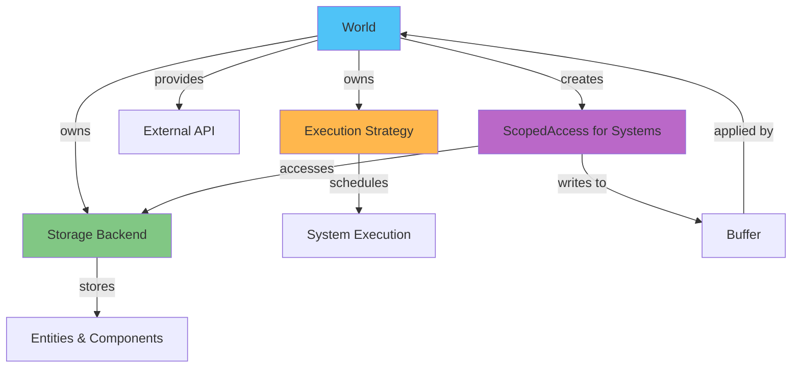
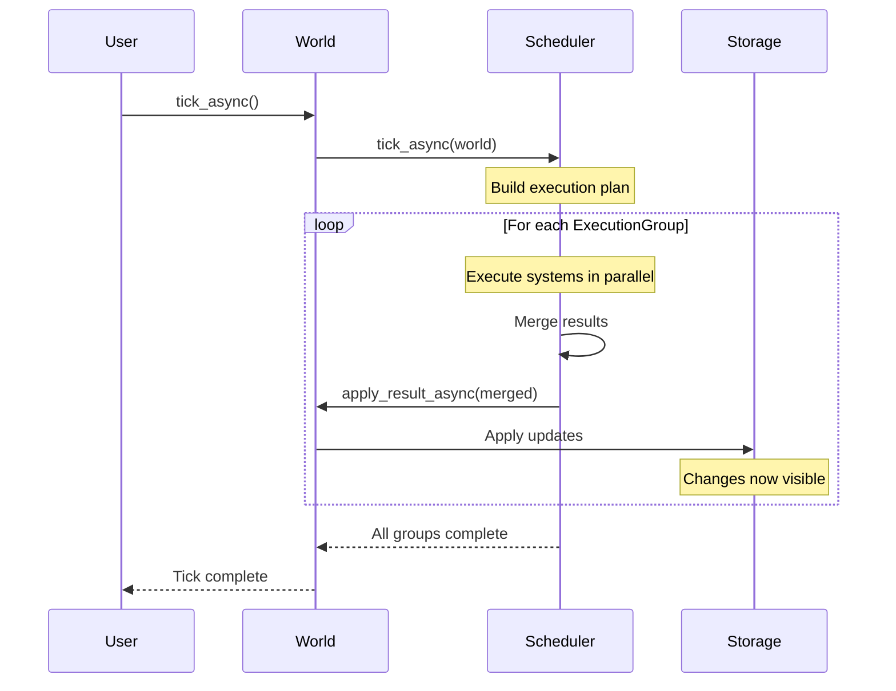
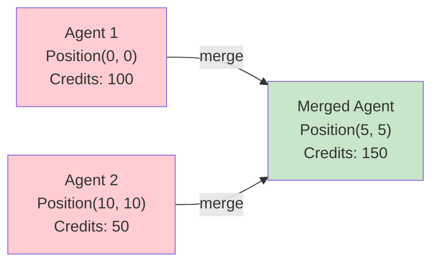
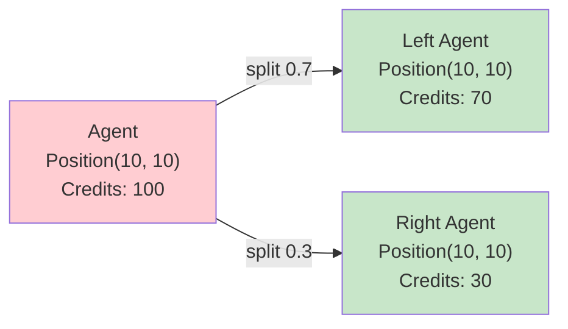
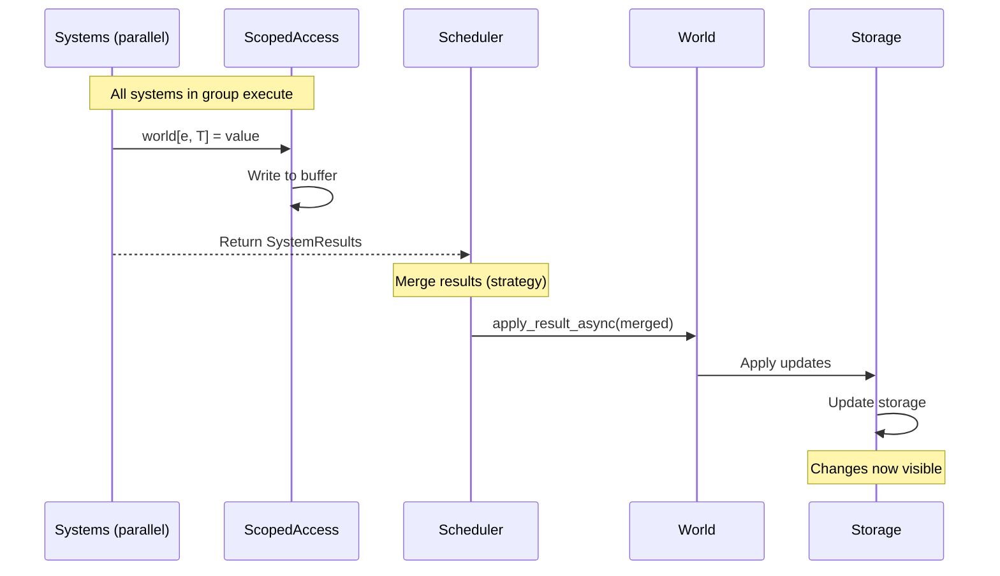

# World Management

The World serves as the central hub for managing entities, components, and systems within AgentECS. It coordinates entity lifecycle, orchestrates system execution, and maintains consistency through tick-based updates.

## Overview

The `World` is the main entry point for AgentECS. It owns the storage backend and execution strategy, providing a clean API for entity management while systems interact through `ScopedAccess` for controlled, safe access.

**Key Responsibilities:**

- **Entity Lifecycle**: Create, destroy, merge, and split entities
- **Component Management**: Get/set components on entities
- **System Orchestration**: Register and execute systems via execution strategy
- **Tick Coordination**: Advance simulation time with atomic state updates
- **Singleton Management**: Global state via well-known entities



## World Structure

The World is initialized with optional storage and execution strategy:

```python
from agentecs import World
from agentecs.scheduling import SimpleScheduler
from agentecs.storage import LocalStorage

# Default: LocalStorage + SimpleScheduler
world = World()

# Custom storage
world = World(storage=LocalStorage(shard=0))

# Custom execution strategy
world = World(execution=SimpleScheduler())  # Parallel scheduler

# Both custom
world = World(
    storage=LocalStorage(),
    execution=SimpleScheduler()
)
```

**World Internals:**

- `_storage`: Storage backend (implements `Storage` protocol)
- `_execution`: Execution strategy (implements `ExecutionStrategy` protocol)
- Reserved entities: `SystemEntity.WORLD`, `SystemEntity.CLOCK` (created automatically)

## Tick Execution

Ticks are the fundamental unit of simulation time in AgentECS. Each tick executes execution groups sequentially, applying results at group boundaries:

1. **Build execution plan** (group systems by execution strategy)
2. **For each execution group:**
   - Execute systems in parallel with snapshot isolation
   - Merge results using configured strategy
   - Apply changes atomically to storage
3. **Next group sees applied changes**



**Basic Usage:**

```python
world = World()

# Register systems
world.register_system(movement_system)
world.register_system(collision_system)

# Advance simulation
world.tick()  # Sync wrapper
# or
await world.tick_async()  # Async
```

**Tick Methods:**

=== "Async (Recommended)"

    ```python
    async def main():
        world = World()
        world.register_system(my_system)

        for _ in range(100):
            await world.tick_async()
    ```

=== "Sync Wrapper"

    ```python
    def main():
        world = World()
        world.register_system(my_system)

        for _ in range(100):
            world.tick()  # Calls asyncio.run() internally
    ```

!!! tip "Use Async for I/O-Bound Workloads"
    If your systems make API calls, database queries, or other I/O operations, use `tick_async()` directly for better concurrency.

### Snapshot Isolation Within Execution Groups

Systems within the same execution group see the same initial snapshot:

```python
# Initial state: Entity has Position(0, 0)

# Both in same execution group (normal systems)
@system(reads=(Position,), writes=(Position,))
def system_a(world: ScopedAccess) -> None:
    for entity, pos in world(Position):
        world[entity, Position] = Position(10, 10)
        # System A's buffer: Position(10, 10)

@system(reads=(Position,), writes=(Velocity,))
def system_b(world: ScopedAccess) -> None:
    for entity, pos in world(Position):
        # System B sees Position(0, 0) from snapshot
        # NOT System A's buffered Position(10, 10)
        print(f"Position: {pos.x}, {pos.y}")  # Prints: 0, 0

# After group: Results merged and Position(10, 10) applied to storage
# Next group would see Position(10, 10)
```

**Dev systems see previous group changes:**

```python
@system.dev()  # Runs in own group, BEFORE normal systems
def debug_system(world: ScopedAccess) -> None:
    for entity, pos in world(Position):
        world[entity, Position] = Position(5, 5)

# debug_system runs → results applied → Position(5, 5) now in storage

# Then normal systems run (same group)
@system(reads=(Position,), writes=(Position,))
def normal_system(world: ScopedAccess) -> None:
    for entity, pos in world(Position):
        # Sees Position(5, 5) from debug_system's group
        print(f"Position: {pos.x}, {pos.y}")  # Prints: 5, 5
```

## Entity Management

### Creating Entities

**spawn() - Create Entity with Components:**

```python
from agentecs import World

world = World()

# Spawn entity with components
agent = world.spawn(
    Position(0, 0),
    Velocity(1, 0),
    Health(100, 100),
    AgentTag(name="Alice")
)

# Returns EntityId
print(agent)  # EntityId(shard=0, index=1, generation=0)

# Spawn without components
empty = world.spawn()
```

**Batch Spawning:**

```python
agents = []
for i in range(100):
    agent = world.spawn(
        Position(i, 0),
        Velocity(1, 0),
        AIAgent(name=f"Agent{i}")
    )
    agents.append(agent)
```

!!! tip "spawn() is for External Use"
    Use `world.spawn()` to create entities **outside** systems. Systems should use `ScopedAccess` methods or return spawn commands in `SystemResult`.

### Deleting Entities

**destroy() - Delete Entity:**

```python
world.destroy(entity_id)
# Entity and all its components are removed
```

!!! warning "Destroying Non-Existent Entities"
    Destroying an entity that doesn't exist or was already destroyed is a no-op in LocalStorage. Future storage backends may raise errors.

**Systems Can Destroy Entities:**

```python
@system.dev()
def cleanup_dead(world: ScopedAccess) -> None:
    """Remove entities with health <= 0."""
    to_remove = []
    for entity, health in world(Health):
        if health.hp <= 0:
            to_remove.append(entity)

    for entity in to_remove:
        world.destroy(entity)  # Mark for destruction
```

### Splitting and Merging Entities

AgentECS supports dynamic entity composition through merge and split operations:

#### Merge Entities

Combine two entities into one new entity:

```python
from agentecs import NonMergeableHandling

# Merge two agents
merged = world.merge_entities(
    agent1,
    agent2,
    on_non_mergeable=NonMergeableHandling.FIRST
)

# agent1 and agent2 are destroyed
# merged is a new entity with combined components
```

**Merge Strategies:**

<div class="grid cards" markdown>

- :material-numeric-1-box: **FIRST**

    Keep component from first entity

- :material-numeric-2-box: **SECOND**

    Keep component from second entity

- :material-close-box: **SKIP**

    Exclude component from merged entity

- :material-alert-box: **ERROR**

    Raise TypeError if component not Mergeable

</div>

**Merge Behavior:**



Components implementing `Mergeable` protocol are merged via `__merge__()`. Non-mergeable components use the specified strategy.

**Example:**

```python
@component
@dataclass
class Credits:
    amount: float

    def __merge__(self, other: "Credits") -> "Credits":
        return Credits(self.amount + other.amount)

@component
@dataclass
class AgentTag:
    name: str
    # No __merge__ - not mergeable

# Create agents
a1 = world.spawn(Credits(100), AgentTag("Alice"))
a2 = world.spawn(Credits(50), AgentTag("Bob"))

# Merge - Credits sum, AgentTag uses FIRST strategy
merged = world.merge_entities(a1, a2, on_non_mergeable=NonMergeableHandling.FIRST)

credits = world.get(merged, Credits)
print(credits.amount)  # 150

tag = world.get(merged, AgentTag)
print(tag.name)  # "Alice" (from first entity)
```

#### Split Entity

Divide one entity into two new entities:

```python
from agentecs import NonSplittableHandling

# Split agent 70/30
left, right = world.split_entity(
    agent,
    ratio=0.7,
    on_non_splittable=NonSplittableHandling.BOTH
)

# agent is destroyed
# left gets 70%, right gets 30%
```

**Split Strategies:**

<div class="grid cards" markdown>

- :material-arrow-left-bold: **FIRST**

    Give component to first entity only

- :material-arrow-split-horizontal: **BOTH**

    Deep copy component to both entities

- :material-close-box: **SKIP**

    Exclude from both entities

- :material-alert-box: **ERROR**

    Raise TypeError if component not Splittable

</div>

**Split Behavior:**



**Example:**

```python
@component
@dataclass
class Credits:
    amount: float

    def __split__(self, ratio: float = 0.5) -> tuple["Credits", "Credits"]:
        left = Credits(self.amount * ratio)
        right = Credits(self.amount * (1 - ratio))
        return left, right

@component
@dataclass
class Position:
    x: float
    y: float
    # No __split__ - not splittable

# Create agent
agent = world.spawn(Credits(100), Position(10, 10))

# Split 60/40 - Credits split, Position cloned to both
left, right = world.split_entity(
    agent,
    ratio=0.6,
    on_non_splittable=NonSplittableHandling.BOTH
)

left_credits = world.get(left, Credits)
print(left_credits.amount)  # 60

right_credits = world.get(right, Credits)
print(right_credits.amount)  # 40

# Both have Position (cloned)
assert world.get(left, Position).x == 10
assert world.get(right, Position).x == 10
```

!!! tip "Use Cases for Merge/Split"
    - **Agent Merging**: Combine specialized agents into generalist
    - **Agent Splitting**: Divide work across multiple agents
    - **Resource Distribution**: Split resources between entities
    - **Consensus Building**: Merge agents that converge on a solution

## Registering Systems

Systems are registered via `register_system()`, which delegates to the execution strategy:

```python
world = World()

# Register systems
world.register_system(movement_system)
world.register_system(collision_system)
world.register_system(render_system)

# Order matters for sequential scheduler
# Parallel scheduler groups non-conflicting systems
```

**Registration is Declarative:**

```python
@system(reads=(A,), writes=(B,))
def my_system(world: ScopedAccess) -> None:
    pass

# System metadata captured in SystemDescriptor
descriptor = my_system  # my_system IS a SystemDescriptor
world.register_system(descriptor)
```

!!! info "Execution Strategy Decides Order"
    - **SequentialScheduler**: Runs systems one at a time (max_concurrent=1)
    - **SimpleScheduler**: Runs all systems in parallel, merges results
    - Future schedulers may reorder based on dependencies, frequency, or learned patterns

## Accessing the World in Systems

Systems receive `ScopedAccess`, not `World` directly. This enforces access control and enables safe parallelization.

### WorldAccess and Modes of Access

**Three Access Interfaces:**

1. **ScopedAccess** - Standard access with read/write control
2. **ReadOnlyAccess** - Read-only for observers and pure systems
3. **Dev Mode (ScopedAccess with AllAccess)** - Unrestricted for debugging

```python
from agentecs import ScopedAccess, ReadOnlyAccess, SystemMode

# Standard system
@system(reads=(Position,), writes=(Velocity,))
def standard(world: ScopedAccess) -> None:
    pass

# Read-only system
@system.readonly(reads=(Metrics,))
def observer(world: ReadOnlyAccess) -> None:
    pass

# Pure system
@system(reads=(Input,), writes=(Output,), mode=SystemMode.PURE)
def pure_transform(world: ReadOnlyAccess) -> dict:
    return {entity: {Output: Output(inp.value * 2)}
            for entity, inp in world.query(Input)}

# Dev mode
@system.dev()
def debug(world: ScopedAccess) -> None:
    pass
```

### Querying Entities and Components

See [Queries](queries.md) for detailed query documentation.

**Quick Reference:**

```python
@system(reads=(Position, Velocity), writes=(Position,))
def movement(world: ScopedAccess) -> None:
    # Multi-component query
    for entity, pos, vel in world(Position, Velocity):
        world[entity, Position] = Position(pos.x + vel.dx, pos.y + vel.dy)

    # Single component
    for entity, pos in world(Position):
        process(pos)

    # With Query objects
    from agentecs import Query
    for entity, pos in world.query(Query(Position).excluding(FrozenTag)):
        process(pos)
```

### Direct Access to the World

`ScopedAccess` provides magic methods for direct component access:

!!! warning "Reads Return Copies"
    `world[entity, Type]` and `world.get()` return **deep copies**. You must write back any changes via `world[entity, Type] = value`.

**Magic Method Reference:**

```python
@system.dev()
def direct_access_demo(world: ScopedAccess) -> None:
    entity = some_entity_id

    # Get component (returns copy)
    pos = world[entity, Position]

    # Set component (buffered)
    world[entity, Position] = Position(10, 20)

    # Delete component (buffered)
    del world[entity, Velocity]

    # Check membership
    if (entity, Health) in world:
        print("Has health")

    # Has component (alternative)
    if world.has(entity, Position):
        print("Has position")

    # Get EntityHandle for repeated access
    e = world.entity(entity)
    e[Position] = Position(5, 5)
    if Velocity in e:
        vel = e[Velocity]
```

**Buffer Awareness:**

```python
@system(reads=(Position,), writes=(Position,))
def buffering_demo(world: ScopedAccess) -> None:
    entity = some_entity

    # Initial read from storage
    pos1 = world[entity, Position]
    print(pos1.x)  # e.g., 0

    # Write to buffer
    world[entity, Position] = Position(10, 10)

    # Subsequent read sees buffer
    pos2 = world[entity, Position]
    print(pos2.x)  # 10 (from buffer)

    # Storage still has old value until group boundary
```

## Updating the World

### Methods for Updating the World State

**External API (Outside Systems):**

```python
world = World()

# Spawn entities
entity = world.spawn(Position(0, 0), Velocity(1, 0))

# Get component (returns copy)
pos = world.get(entity, Position)

# Set component
world.set(entity, Position(10, 10))

# Destroy entity
world.destroy(entity)

# Singletons
world.set_singleton(GlobalConfig(temperature=0.7))
config = world.singleton(GlobalConfig)
```

**System API (Inside Systems):**

```python
@system(reads=(Position,), writes=(Position, Velocity))
def system_updates(world: ScopedAccess) -> None:
    # Query and update
    for entity, pos in world(Position):
        world[entity, Position] = Position(pos.x + 1, pos.y)

    # Spawn from system
    new_entity = world.spawn(Position(0, 0), Velocity(1, 1))

    # Destroy from system
    world.destroy(old_entity)

    # Direct component operations
    world[entity, Velocity] = Velocity(2, 2)
    del world[entity, SomeComponent]
```

### Result Application Workflow

After each execution group completes, results are merged and applied:



**Application Order:**

1. **Updates**: Modify existing components
2. **Inserts**: Add new components
3. **Removes**: Delete components
4. **Spawns**: Create entities
5. **Destroys**: Delete entities

!!! info "Atomic Application at Group Boundaries"
    All changes from an execution group are merged, then applied atomically to storage. Subsequent groups see these applied changes.

## Snapshots and Restore

World supports serialization for save/load functionality:

```python
# Save world state
snapshot_bytes = world.snapshot()

# Store to disk
with open("save.bin", "wb") as f:
    f.write(snapshot_bytes)

# Restore world state
with open("save.bin", "rb") as f:
    data = f.read()

world.restore(data)
```

!!! warning "Snapshot Limitations"
    - Only component data is serialized, not systems or execution state
    - Uses `pickle` in LocalStorage (not secure for untrusted data)
    - Custom serialization may be needed for distributed storage backends

## World Best Practices

!!! tip "Prefer ScopedAccess in Systems"
    Never pass `World` directly to systems. Always use `ScopedAccess` to enforce access control and enable parallelization.

!!! tip "Batch Entity Operations"
    Creating/destroying many entities? Do it outside systems when possible, or return batch operations in `SystemResult`.

!!! warning "Don't Hold EntityId Across Ticks"
    EntityIds use generational indices. An ID may be recycled for a different entity after destruction. Always check `world.has()` before use.

!!! tip "Use Merge/Split Strategically"
    Merge/split operations destroy original entities. Design your components and strategies carefully to preserve important data.

!!! info "Singletons for Global State"
    Use `world.set_singleton()` for configuration, shared resources, or environment parameters. Access via `SystemEntity.WORLD` in systems.

## See Also

- **[Components](components.md)**: Define data that entities hold
- **[Systems](systems.md)**: Define logic that operates on entities
- **[Queries](queries.md)**: Find entities by component combinations
- **[Scheduling](scheduling.md)**: How the world orchestrates system execution
- **[Storage](storage.md)**: How entities and components are stored
