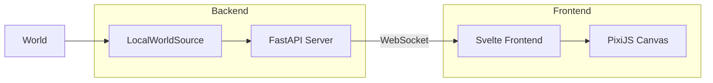

# Architecture

## System Overview



The visualizer has three layers:

1. **Source** – Wraps a World and emits snapshots
2. **Server** – FastAPI with WebSocket streaming
3. **Frontend** – Svelte 5 + PixiJS 8 canvas

## WorldStateSource Protocol

All sources implement this async protocol:

```python
class WorldStateSource(Protocol):
    async def connect(self) -> None: ...
    async def disconnect(self) -> None: ...
    async def get_snapshot(self) -> WorldSnapshot: ...
    def subscribe_events(self) -> AsyncIterator[WorldEvent]: ...
    async def send_command(self, command: str, **kwargs) -> None: ...

    @property
    def is_connected(self) -> bool: ...
```

### Commands

| Command | Args | Description |
|---------|------|-------------|
| `pause` | – | Pause world execution |
| `resume` | – | Resume execution |
| `step` | – | Execute single tick (when paused) |
| `set_tick_rate` | `ticks_per_second` | Change tick rate |
| `seek` | `tick` | Jump to tick (replay only) |
| `set_speed` | `speed` | Playback multiplier (replay only) |

## Data Models

### WorldSnapshot

```python
class WorldSnapshot(BaseModel):
    tick: int = 0
    entity_count: int = 0
    entities: list[EntitySnapshot] = []
    metadata: dict[str, Any] = {}

    @computed_field
    def archetypes(self) -> list[tuple[str, ...]]: ...
```

### EntitySnapshot

```python
class EntitySnapshot(BaseModel):
    id: int
    components: list[ComponentSnapshot]

    @computed_field
    def archetype(self) -> tuple[str, ...]: ...
```

### ComponentSnapshot

```python
class ComponentSnapshot(BaseModel):
    type_name: str   # "myapp.components.Position"
    type_short: str  # "Position"
    data: dict[str, Any]
```

## Source Types

| Source | Use Case | History |
|--------|----------|---------|
| `LocalWorldSource` | In-process World | No |
| `MockWorldSource` | Testing/demos | No |
| `ReplayWorldSource` | Playback recordings | Yes |
| `HistoryCapturingSource` | Wrap any source + record | Yes |

### LocalWorldSource

Wraps an AgentECS World instance and controls tick execution:

```python
from agentecs import World
from agentecs_viz.sources import LocalWorldSource

world = World()
source = LocalWorldSource(world, tick_interval=0.5)

await source.connect()
# Ticks happen automatically at tick_interval
# Use send_command("pause"/"resume"/"step") to control
```

### MockWorldSource

Generates fake entities for development:

```python
from agentecs_viz.sources import MockWorldSource

source = MockWorldSource(
    entity_count=50,
    tick_interval=1.0,
    archetypes=[
        ("Position", "Velocity"),
        ("Task", "Priority"),
        ("Agent", "Memory"),
    ]
)
```

### ReplayWorldSource

Plays back from a HistoryStore:

```python
from agentecs_viz.sources import ReplayWorldSource
from agentecs_viz.history import FileHistoryStore

store = FileHistoryStore(Path("trace.jsonl"), mode="r")
source = ReplayWorldSource(store, autoplay=False)
```

## Event Types

```python
class TickEvent(WorldEvent):
    snapshot: WorldSnapshot

class HistoryInfoEvent(WorldEvent):
    supports_replay: bool
    tick_range: tuple[int, int] | None
    is_paused: bool

class SeekCompleteEvent(WorldEvent):
    tick: int
    snapshot: WorldSnapshot
```

## Frontend Stack

| Layer | Technology |
|-------|------------|
| Framework | Svelte 5 (runes) |
| Canvas | PixiJS 8 |
| Pan/Zoom | pixi-viewport |
| Styling | Tailwind CSS v4 |
| State | Svelte stores |
| Build | Vite |

### Semantic Zoom

The canvas renders differently based on viewport scale:

```
MICRO (>2.5×)     DETAIL (0.8-2.5×)    MESO (0.3-0.8×)    MACRO (<0.3×)
┌──────────┐      ┌──────────┐         ┌──────────┐       ┌──────────┐
│  ┌───┐   │      │  ○ ○     │         │  ·  ·    │       │▓▓▓░░░░░░│
│  │ A │   │      │    ○ ○   │         │   (12)   │       │▓▓▓▓░░░░░│
│  │pos│   │      │  ○    ○  │         │  ·  · ·  │       │░░░▓▓▓▓▓▓│
│  └───┘   │      │     ○    │         │    (8)   │       │░░░░▓▓▓▓▓│
└──────────┘      └──────────┘         └──────────┘       └──────────┘
 Focal entity     Colored circles      Clusters+labels    Density heatmap
```

## WebSocket Protocol

The server streams JSON messages over `/ws`:

**Server → Client:**
```json
{"type": "tick", "snapshot": {...}}
{"type": "history_info", "supports_replay": true, "tick_range": [0, 100], "is_paused": false}
{"type": "seek_complete", "tick": 50, "snapshot": {...}}
```

**Client → Server:**
```json
{"command": "pause"}
{"command": "resume"}
{"command": "step"}
{"command": "seek", "tick": 42}
{"command": "set_tick_rate", "ticks_per_second": 2}
```
